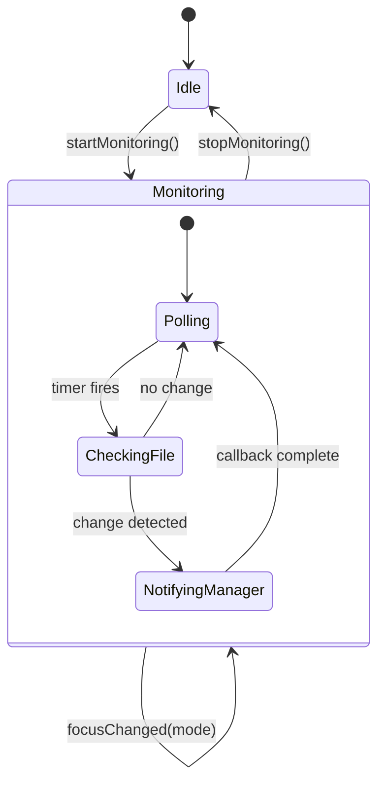
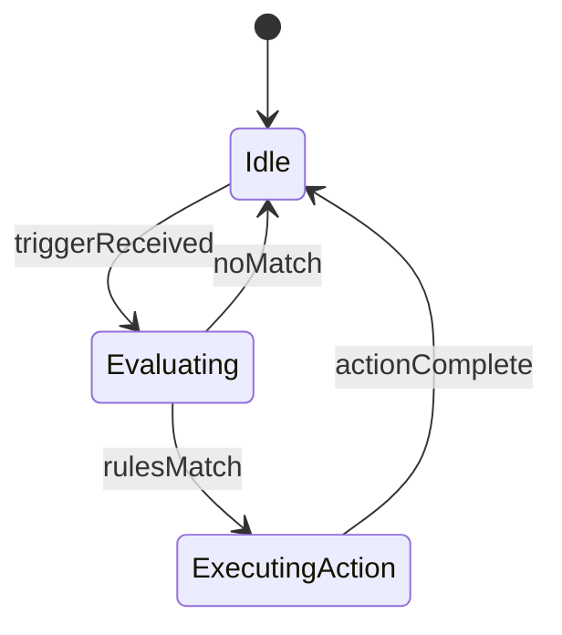

# Rules Engine & Focus Mode Research

> Created: 2026-01-19
> Status: ✅ Complete
> Purpose: Research for Mac Nerd Phase 1 features
>
> **Cross-References:**
> - [FEATURE_PLAN.md](../../FEATURE_PLAN.md) - Mac Nerd proposal & implementation phases
> - [ROADMAP.md](../../ROADMAP.md) - Rules Engine marked as Planned
> - [FOUNDER_CHECKLIST.md](/Users/sj/SaneApps/infra/SaneProcess/templates/FOUNDER_CHECKLIST.md) - Analytics/telemetry setup
> - [WiFi Trigger Research](./p0-wifinetwork-trigger.md) - CoreWLAN implementation

---

## Research Categories

### 1. Memory (Past Work/Bugs)
**Status:** ✅ Complete

**Findings:**
- [x] **WiFi Network Triggers already researched** - See `p0-wifinetwork-trigger.md` (2026-01-04)
  - CoreWLAN framework: `CWWiFiClient`, `CWEventDelegate`
  - Full implementation approach with `NetworkTriggerService`
  - No special permissions needed (must be unsandboxed - SaneBar already is)
  - Gotchas documented: nil SSID, case sensitivity, event flooding
- [x] No Focus Mode specific research found - needed fresh research
- [x] Bartender uses "Triggers" as part of "Presets" system (from competitor analysis)
- [x] Ice does NOT have WiFi triggers, only hover/click/keyboard
- [x] **Founder Checklist** addresses "flying blind" - TelemetryDeck for analytics

---

### 2. Apple Docs (API Verification)
**Status:** ✅ Complete

**APIs Verified:**

| API | Framework | Purpose | macOS Version |
|-----|-----------|---------|---------------|
| `INFocusStatusCenter` | Intents | Official Focus detection | 15.0+ |
| `SetFocusFilterIntent` | AppIntents | Respond to Focus changes | 13.0+ |
| `FocusFilterAppContext` | AppIntents | App-specific Focus config | 13.0+ |
| `DistributedNotificationCenter` | Foundation | System-wide notifications | All |
| `CWWiFiClient` | CoreWLAN | WiFi network detection | All |
| `IOPSCopyPowerSourcesInfo` | IOKit | Battery state | All |
| `NSWorkspace.runningApplications` | AppKit | Running app detection | All |

**Focus Mode Detection - Official API:**
```swift
import Intents

// Check if Focus is active (requires authorization)
let status = INFocusStatusCenter.default.authorizationStatus
if status == .authorized {
    let isFocused = INFocusStatusCenter.default.focusStatus.isFocused
}
```

**Limitations of Official API:**
- Requires user authorization
- Cannot get Focus MODE NAME (Work, Personal, etc.) - only boolean isFocused
- KVO observation doesn't work reliably
- Designed for communication apps, not utilities

---

### 3. Web Search (Best Practices)
**Status:** ✅ Complete

**Key Findings:**

**Alternative Approach - Read JSON Files (Unsandboxed Apps Only):**
```swift
// Focus Mode state stored in:
// ~/Library/DoNotDisturb/DB/Assertions.json - manually set modes
// ~/Library/DoNotDisturb/DB/ModeConfigurations.json - all configured modes

let assertionsPath = "~/Library/DoNotDisturb/DB/Assertions.json"
let configPath = "~/Library/DoNotDisturb/DB/ModeConfigurations.json"
```

**JXA Script Pattern (from [drewkerr gist](https://gist.github.com/drewkerr/0f2b61ce34e2b9e3ce0ec6a92ab05c18)):**
```javascript
const assert = getJSON("~/Library/DoNotDisturb/DB/Assertions.json")
const config = getJSON("~/Library/DoNotDisturb/DB/ModeConfigurations.json")
if (assert) {
    modeid = assert[0].assertionDetails.assertionDetailsModeIdentifier
    focus = config[modeid].mode.name  // Gets actual mode name!
}
```

**Limitations:**
- Cross-device sync: Focus set from iPhone may not appear in macOS files
- Requires Full Disk Access if sandboxed (SaneBar is unsandboxed - OK)
- Geolocation triggers not captured in these files

**Sources:**
- [Hacking with Swift Forums](https://www.hackingwithswift.com/forums/swiftui/api-to-detect-focus-mode-personal-work-sleep-etc/25818)
- [Automators Talk](https://talk.automators.fm/t/get-current-focus-mode-via-script/12423)
- [sindresorhus/do-not-disturb](https://github.com/sindresorhus/do-not-disturb)

---

### 4. GitHub (External Examples)
**Status:** ✅ Complete

**Relevant Projects:**
- **FuzzyIdeas/IsThereNet** - Uses INFocusStatusCenter in menu bar app
- **sindresorhus/do-not-disturb** - Mature DND control library

**No direct Focus Mode detection library found** - most apps use:
1. Official `INFocusStatusCenter` (limited)
2. File-based detection (reading DoNotDisturb JSON)
3. DistributedNotificationCenter for state changes

**Recommended Notification to Monitor:**
```swift
DistributedNotificationCenter.default().addObserver(
    forName: NSNotification.Name("com.apple.focusui.setStatus"),
    object: nil,
    queue: .main
) { notification in
    // Focus Mode changed
}
```

---

### 5. Local Codebase (Existing Patterns)
**Status:** ✅ Complete

**Key Architecture Findings:**

**Existing Service Pattern (follow this):**
```swift
// From NetworkTriggerService - same pattern for FocusModeService
@MainActor
final class NetworkTriggerService: NSObject, CWEventDelegate {
    private weak var menuBarManager: MenuBarManager?
    private var isMonitoring = false

    func configure(menuBarManager: MenuBarManager)
    func startMonitoring()
    func stopMonitoring()
}
```

**MenuBarManager Integration:**
- Services configured at init time
- Settings observer auto-updates services
- All triggers call `showHiddenItemsNow(trigger:)`

**Existing Trigger Types:**
| Trigger | Service | How It Works |
|---------|---------|--------------|
| App Launch | TriggerService | NSWorkspace notifications |
| Battery | TriggerService | 30-second polling |
| WiFi | NetworkTriggerService | CWEventDelegate |
| Hover | HoverService | NSEvent mouse monitoring |
| Scroll | HoverService | NSEvent scroll monitoring |

**Profile System Already Exists:**
```swift
struct SaneBarProfile: Codable, Identifiable, Sendable {
    let id: UUID
    var name: String
    var settings: SaneBarSettings
}
```

**RulesSettingsView.swift** already has UI for triggers - add Focus Mode section there.

---

## Summary & Recommendations

### Recommended Implementation Approach

**Option A: File-Based Detection (RECOMMENDED)**
- Read `~/Library/DoNotDisturb/DB/Assertions.json`
- Gets actual Focus Mode NAME (Work, Personal, etc.)
- Works because SaneBar is unsandboxed
- Poll every 5-10 seconds or use FSEvents to watch file changes

**Option B: Official API + DistributedNotificationCenter**
- Use `INFocusStatusCenter` for boolean isFocused
- Monitor `com.apple.focusui.setStatus` for changes
- Cannot get mode name - only on/off

### Proposed Architecture

```
MenuBarManager (orchestrator)
├── TriggerService (app launch, battery)
├── NetworkTriggerService (WiFi)
├── HoverService (mouse/scroll)
├── FocusModeService (NEW)        ← Add this
│   ├── Monitor Focus state changes
│   ├── Get current mode name (file-based)
│   └── Callback to MenuBarManager
└── RulesEngine (NEW)             ← Add this
    ├── Evaluate composite rules
    ├── IF Focus="Work" AND WiFi="office" THEN...
    └── Support AND/OR logic
```

### New Settings Needed

```swift
// Add to SaneBarSettings
var focusModeRulesEnabled: Bool = false
var focusModeRules: [FocusModeRule] = []

struct FocusModeRule: Codable {
    var focusModeName: String  // "Work", "Personal", "Sleep"
    var action: RuleAction     // .showIcons, .hideIcons, .applyProfile
    var profileId: UUID?       // If action is .applyProfile
}
```

---

## State Machine Updates Needed

### FocusModeService State Machine



### RulesEngine State Machine



---

## Implementation Checklist

- [ ] Create `FocusModeService.swift` following NetworkTriggerService pattern
- [ ] Add Focus Mode settings to `SaneBarSettings`
- [ ] Add Focus Mode section to `RulesSettingsView`
- [ ] Create `RulesEngine.swift` for composite rule evaluation
- [ ] Add tests for FocusModeService
- [ ] Update MenuBarManager to integrate FocusModeService
- [ ] Document in CHANGELOG when shipped

---

## API Risk Assessment

| Approach | Stability | Sandbox | Gets Mode Name | Effort |
|----------|-----------|---------|----------------|--------|
| File-based (JSON) | Medium | Unsandboxed only | ✅ Yes | Low |
| INFocusStatusCenter | High | Any | ❌ No | Low |
| DistributedNotification | Medium | Any | ❌ No | Low |
| Hybrid (all 3) | High | Unsandboxed | ✅ Yes | Medium |

**Recommendation:** Use hybrid approach - file-based for mode name, DistributedNotification for instant change detection.
