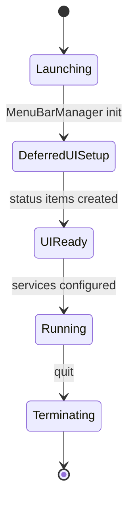
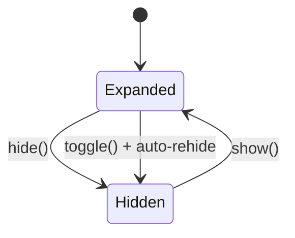
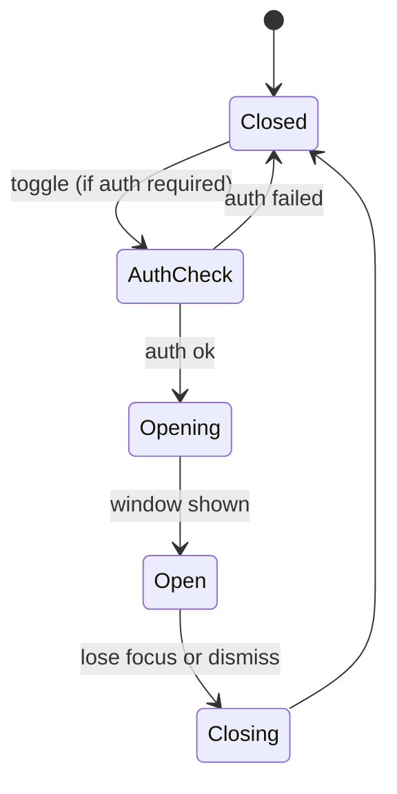
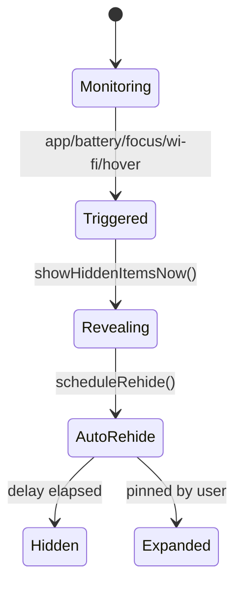
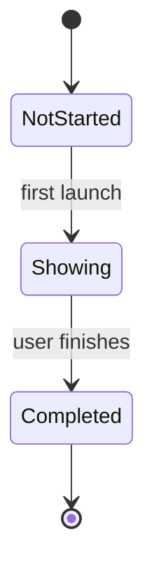
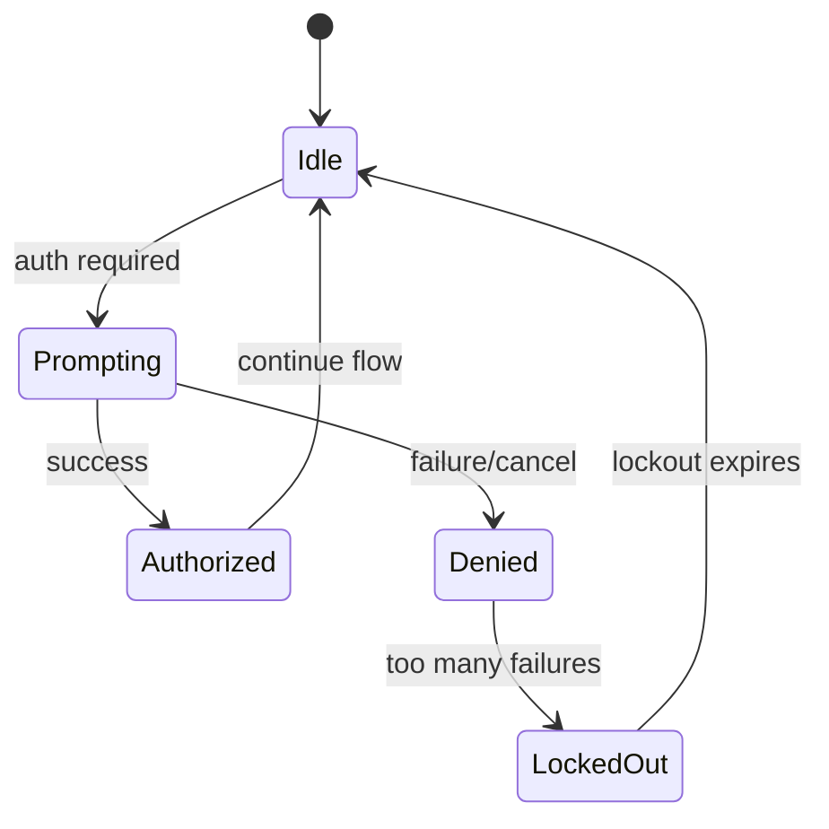

# SaneBar Architecture

Last updated: 2026-02-09

This document explains how SaneBar is structured, how it moves menu bar icons, and how the major services interact. It is written to be useful to any developer (Swift, macOS, or otherwise).

## Goals and Non-Goals

Goals
- Provide reliable hide/show of menu bar icons.
- Programmatically move icons between zones (visible/hidden/always-hidden) via CGEvent Cmd+drag.
- Keep all data on-device; avoid telemetry and external dependencies for core behavior.
- Make behavior predictable (clear triggers, clear state).
- Keep the app safe to run at login and in headless/test contexts.

Non-goals
- No cloud services for core features.
- No direct manipulation of other app windows.

## System Context

SaneBar is a macOS menu bar app that relies on:
- NSStatusItem for the menu bar UI.
- Accessibility (AXUIElement) to read and interact with menu bar items.
- Sparkle for updates (appcast feed).
- CoreWLAN and Focus Mode files for automation triggers.

The app itself is a single process with modular services that all route through MenuBarManager.

## Architecture Principles

- Single orchestration point: MenuBarManager is the source of truth for state.
- Services are small and focused (one responsibility per service).
- User intent wins: manual reveal pins visibility until explicit hide.
- Safe defaults: start expanded, validate, then hide.
- Main-thread safety: UI state changes are @MainActor.

## Core Components (What does what)

| Component | Responsibility | Key Files |
|---|---|---|
| MenuBarManager | Orchestrates state, services, and user actions | `Core/MenuBarManager.swift` |
| StatusBarController | Creates and configures status items and menu | `Core/Controllers/StatusBarController.swift` |
| HidingService | Controls hide/show via delimiter length toggle | `Core/Services/HidingService.swift` |
| AccessibilityService | Reads menu bar items and performs AX actions | `Core/Services/AccessibilityService.swift` (+ extensions) |
| SearchService | Finds hidden icons and activates them | `Core/Services/SearchService.swift` |
| SettingsController | Loads/saves settings, publishes changes | `Core/Controllers/SettingsController.swift` |
| PersistenceService | JSON storage for settings and profiles | `Core/Services/PersistenceService.swift` |
| TriggerService | App launch + low battery triggers | `Core/Services/TriggerService.swift` |
| NetworkTriggerService | WiFi SSID triggers | `Core/Services/NetworkTriggerService.swift` |
| FocusModeService | Focus Mode triggers | `Core/Services/FocusModeService.swift` |
| HoverService | Hover/scroll/click reveal triggers | `Core/Services/HoverService.swift` |
| MenuBarAppearanceService | Menu bar visual styling | `Core/Services/MenuBarAppearanceService.swift` |
| MenuBarSpacingService | System-wide spacing adjustments | `Core/Services/MenuBarSpacingService.swift` |
| UpdateService | Sparkle updates | `Core/Services/UpdateService.swift` |
| AppleScriptCommands | Automation via AppleScript | `Core/Services/AppleScriptCommands.swift` |
| SearchWindowController | Floating Find Icon window | `UI/SearchWindow/SearchWindowController.swift` |
| Onboarding | First-run flow | `UI/Onboarding/*` |

## Key Flows

### App Launch
1. `main.swift` starts app and AppDelegate.
2. AppDelegate sets activation policy, initializes MenuBarManager.
3. MenuBarManager loads settings, then runs deferred UI setup.
4. Status items created, services configured, triggers started if enabled.
5. Initial hide happens after a short delay (unless external monitor rule blocks it).

### Show/Hide Toggle (User Click or Hotkey)
1. User action calls MenuBarManager.toggleHiddenItems().
2. If auth is required and items are hidden, LocalAuthentication is prompted.
3. HidingService toggles delimiter length.
4. MenuBarManager schedules auto-rehide if enabled.
5. Accessibility cache invalidated so Find Icon is accurate.

### Find Icon (Search Window)
1. User opens Search window (Option-click or hotkey).
2. SearchWindowController suspends hover triggers.
3. SearchService queries AccessibilityService cache (or refreshes).
4. Selecting an app reveals hidden items and attempts virtual activation.
5. A longer rehide delay is scheduled for search flow.

### Automation Triggers (Battery, App Launch, WiFi, Focus, Hover)
1. Trigger service detects event.
2. MenuBarManager.showHiddenItemsNow() is called with trigger type.
3. If auth is required, event will be blocked.
4. Auto-rehide scheduled unless pinned.

## State Machines

### App Lifecycle



| State | Meaning | Entry | Exit |
|---|---|---|---|
| Launching | App process starts | main.swift, AppDelegate | MenuBarManager init |
| DeferredUISetup | UI setup delayed for WindowServer readiness | deferredUISetup() | status items ready |
| UIReady | Status items exist, settings loaded | setupStatusItem() | services configured |
| Running | Normal operation | triggers, menu, hotkeys | quit |
| Terminating | App is exiting | NSApplication.terminate | process ends |

### Hide/Show State (HidingService)



| State | Meaning | Entry | Exit |
|---|---|---|---|
| Expanded | Hidden icons are visible | delimiter length = expanded | hide()/toggle() |
| Hidden | Icons are pushed off-screen | delimiter length = collapsed | show()/toggle() |

### Search Window



| State | Meaning | Entry | Exit |
|---|---|---|---|
| Closed | No search window | default | toggle() |
| AuthCheck | Optional Touch ID gate | toggle() | auth ok/failed |
| Opening | Window created or reused | createWindow() | makeKeyAndOrderFront |
| Open | Search active, triggers suspended | window visible | resign key / dismiss |
| Closing | Window hides, triggers resume | close() | Closed |

### Automation Reveal (Triggers)



| State | Meaning | Entry | Exit |
|---|---|---|---|
| Monitoring | Triggers active | services running | trigger event |
| Triggered | Event detected | TriggerService etc | reveal call |
| Revealing | Hidden icons shown | HidingService.show() | schedule rehide |
| AutoRehide | Timer running | scheduleRehide() | hide/pin |

### Onboarding



| State | Meaning | Entry | Exit |
|---|---|---|---|
| NotStarted | First launch | hasCompletedOnboarding = false | show onboarding |
| Showing | Welcome flow visible | showOnboardingIfNeeded() | complete |
| Completed | No onboarding | hasCompletedOnboarding = true | none |

### Auth Gate (Touch ID / Password)



| State | Meaning | Entry | Exit |
|---|---|---|---|
| Idle | No auth in progress | default | reveal request |
| Prompting | LAContext in progress | authenticate() | success/fail |
| Authorized | Reveal allowed | auth ok | continue flow |
| Denied | Reveal blocked | auth failed | rate-limit check |
| LockedOut | Temporary block | max failures hit | timer expires |

## Persistence

Settings and profiles are stored as JSON in Application Support:
- Settings: `~/Library/Application Support/SaneBar/settings.json`
- Profiles: `~/Library/Application Support/SaneBar/profiles/*.json`

Profiles are individual files; the service enforces a max of 50 profiles.

## Concurrency Model

- UI and services are mostly `@MainActor` to avoid NSStatusItem threading issues.
- Background work (caches, timers, monitoring) is driven by Tasks and Combine.
- Accessibility caching uses async refresh to keep Find Icon responsive without blocking UI.

## Permissions and Privacy (What is actually used)

- Accessibility: required for menu bar item discovery and interaction.
- Apple Events: required for AppleScript commands.
- LocalAuthentication: Touch ID/password gating for hidden icons.
- CoreWLAN: WiFi SSID triggers.
- Focus Mode: reads local Focus Mode files for name detection.
- Launch at Login: SMAppService.

See `PRIVACY.md` for details and rationale.

## Updates and Distribution

- Sparkle is used for updates (appcast in Info.plist).
- Update feed: `https://sanebar.com/appcast.xml`.
- Release builds produce a notarized DMG; downloads are hosted via Cloudflare R2 and `dist.sanebar.com`.
- DMGs are never committed to GitHub.

## Build and Release Truth

- **Single source of truth**: `.saneprocess` in the project root.
- **Build/test**: `./scripts/SaneMaster.rb verify` (no raw xcodebuild).
- **Release**: `./scripts/SaneMaster.rb release` (delegates to SaneProcess `release.sh`).
- **DMGs**: uploaded to Cloudflare R2 (not committed to GitHub).
- **Appcast**: Sparkle reads `SUFeedURL` from `SaneBar/Info.plist`.

## Error Handling and Recovery

- Accessibility permission changes are monitored and broadcast.
- HidingService and SearchService guard against nil status items and missing permissions.
- Authentication is rate-limited after repeated failures.
- Deferred UI setup avoids crashes when WindowServer is not ready.

## Testing Strategy

- Unit tests live under `Tests/`.
- Primary entry point for verification: `./scripts/SaneMaster.rb verify`.
- Search/trigger flows are largely integration-tested via MenuBarManager + services.

## Icon Moving Pipeline

### Why CGEvent Cmd+Drag (There Is No Alternative)

There is **no Apple API** for programmatic menu bar icon positioning. This was verified exhaustively:

| Approach | Result |
|----------|--------|
| `kAXPositionAttribute` (AX) | Read-only for menu bar items |
| `NSStatusItem.preferredPosition` | Does not exist |
| UserDefaults `NSStatusItem Preferred Position` | macOS ignores manual writes |
| `AXUIElementSetAttributeValue` | Returns error for status items |
| WWDC sessions | Zero results on this topic |

**Every app that moves icons uses the same hack:** simulate Cmd+drag via CGEvent.
- **Ice** (25.8k stars): CGEvent + dual event taps ("scrombleEvent") + 5 retries
- **Bartender**: Private APIs (broke on macOS Tahoe, had to rewrite)
- **Dozer**: Gave up — doesn't move icons at all

Sources: [Ice source (MenuBarItemManager.swift)](https://github.com/jordanbaird/Ice/blob/main/Ice/MenuBar/MenuBarItems/MenuBarItemManager.swift), [NSStatusItem docs](https://developer.apple.com/documentation/appkit/nsstatusitem)

### Three-Zone Architecture

Icons live in three zones separated by two NSStatusItem delimiters:

```
[Always-Hidden zone] [AH separator] [Hidden zone] [Main separator] [Visible zone] [System items]
     ← leftmost                                                              rightmost →
```

- **Visible:** Right of main separator. Always shown.
- **Hidden:** Between separators. Shown on click/hover, auto-rehidden.
- **Always-Hidden:** Left of AH separator. Only shown via Find Icon window.

NSStatusItems grow **leftward** — right edge stays fixed, left edge extends. When hidden (length=10000), items are pushed far off-screen left (~x=-3349).

### How Icon Moving Works

**Orchestrator:** `MenuBarManager+IconMoving.swift`
**Drag engine:** `AccessibilityService+Interaction.swift` (`performCmdDrag`)

#### Move sequence:
1. **Expand** — `showAll()` shield pattern toggles both separators to visual size. Required because the 10000px separator physically blocks Cmd+drag in both directions.
2. **Wait** — 300ms for macOS relayout (500ms hits auto-rehide).
3. **Find icon** — AX scan for icon frame by bundle ID.
4. **Calculate target** — Direction-dependent:
   - **To visible:** `max(separatorRightEdge + 1, mainIconLeftEdge - 2)` — just left of SaneBar icon
   - **To hidden:** `max(separatorOrigin - offset, ahSeparatorRightEdge + 2)` — right of AH separator
   - **AH-to-hidden:** Right of AH separator (uses `moveIconFromAlwaysHiddenToHidden`)
5. **Cmd+drag** — 16-step CGEvent drag over ~240ms with cursor hidden, grab at icon center (`midX`).
6. **Verify** — Re-read AX frame, check icon landed on expected side of separator.
7. **Retry** — If verification fails, one retry with updated grab point.
8. **Restore** — `restoreFromShowAll()` + `hide()` to collapse separators back.

#### Key files:

| File | Role |
|------|------|
| `Core/MenuBarManager+IconMoving.swift` | Orchestration, separator reading, zone routing |
| `Core/Services/AccessibilityService+Interaction.swift` | `moveMenuBarIcon()`, `performCmdDrag()`, verification |
| `Core/MenuBarManager.swift` | `lastKnownSeparatorX` cache, `isMoveInProgress` flag |
| `UI/SearchWindow/MenuBarSearchView.swift` | Zone-aware context menus, `appZone()` classifier |
| `UI/SearchWindow/SearchWindowController.swift` | `isMoveInProgress` guards on window close |
| `Tests/IconMovingTests.swift` | 56 regression tests |

### Known Fragilities

1. **First drag sometimes fails** — timing between `showAll()` completing and icons becoming draggable.
2. **Wide icons (>100px)** may need special grab points.
3. **AH-to-Hidden verification is too strict** when separators are flush (both at same X). Move works visually but verification reports failure.
4. **Separator reads -3349** during blocking mode — mitigated by `lastKnownSeparatorX` cache.
5. **Re-hiding after move** can undo the move if macOS hasn't reclassified the icon yet.
6. **This will always be fragile.** Ice has the same open bugs (#684). Accept it and add retries.

### What We Tried That Didn't Work

| Attempt | Why It Failed |
|---------|---------------|
| `show()` instead of `showAll()` | Doesn't trigger proper relayout, icons stay off-screen |
| Target = `separatorX + offset` (fixed overshoot) | Overshoots past SaneBar icon into system area |
| Only expanding for move-to-visible | Move-to-hidden also blocked by 10000px separator |
| No AH boundary clamping | Move-to-hidden overshoots past AH separator |
| 30ms drag timing (6 steps × 5ms) | macOS ignores — too fast for CGEvent to register |
| Implementing "fixes" from audit without verifying bugs exist | Regressed working code (Feb 8 incident) |

## Risks and Tradeoffs

- The hide/show technique relies on NSStatusItem length behavior; macOS changes could affect it.
- Icon moving uses CGEvent Cmd+drag simulation — inherently fragile, may break on macOS updates. No alternative exists.
- Menu bar spacing uses private defaults keys (system-wide effect, logout usually required).
- Accessibility permission is mandatory for most features (including icon moving).
- Focus Mode detection depends on local system files that may change across macOS versions.
