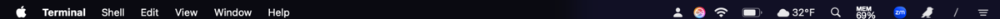
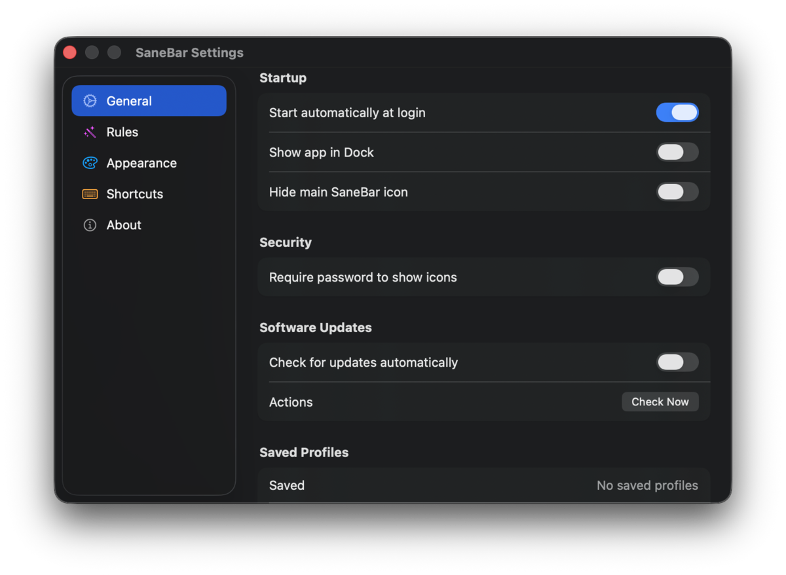
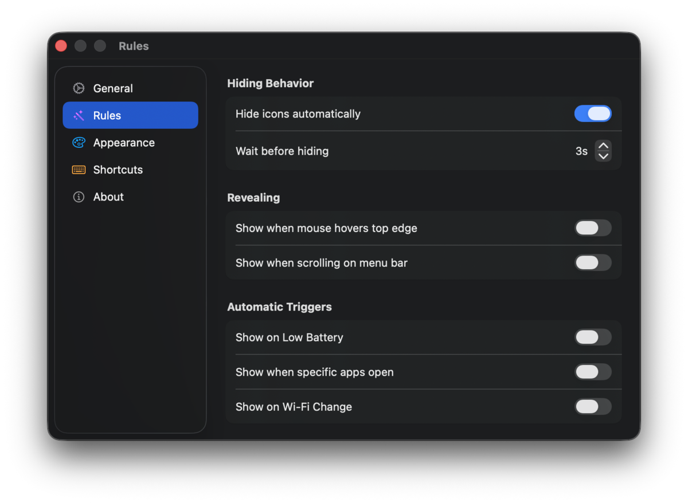
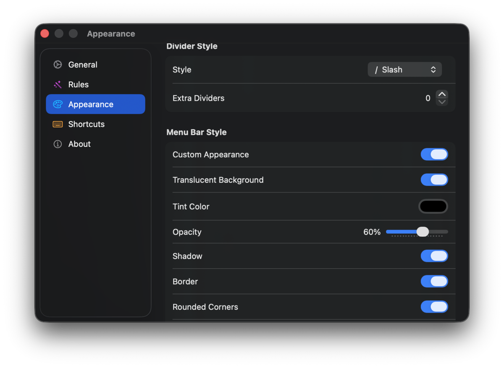
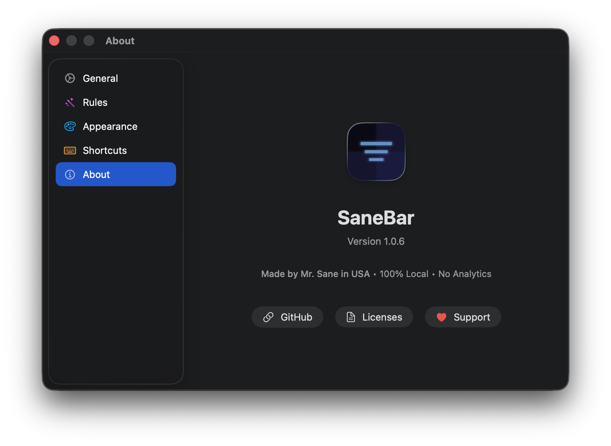

# SaneBar

[](https://github.com/sane-apps/SaneBar/stargazers)
[](LICENSE)
[](https://github.com/sane-apps/SaneBar/releases)
[](https://github.com/sane-apps/SaneBar/releases)
[](PRIVACY.md)
[](https://claude.ai)

> **⭐ Star this repo if it's useful!** · **[💰 Buy for $5](https://sanebar.com)** · Keeps development alive

<a href="https://www.producthunt.com/products/sanebar?utm_source=badge-featured&utm_medium=badge&utm_campaign=badge-sanebar" target="_blank"></a>

**Your menu bar. Not theirs.**

Hide clutter. Lock sensitive icons with Touch ID. Zero spying.

| | |
|---|---|
| ⚡ **Power** | Your device runs it. No cloud required. |
| ❤️ **Love** | $5 once. No subscriptions. Ever. |
| 🧠 **Sound Mind** | Open source. See exactly what it does. |

▶️ **[Watch the demo](https://www.youtube.com/watch?v=I6U3APV-998)** (30 seconds)

[](https://www.youtube.com/watch?v=I6U3APV-998)


### Icons Revealed


### Icons Hidden


---

## Download

**Open source dies without support.** Ice is broken. Hidden Bar is abandoned. Bartender sold out. That's what happens when there's no sustainable model.

SaneBar is different: **open source AND sustainable.**

- **Build it yourself** — Clone the repo, it's GPL v3 licensed, always will be
- **Or pay $5** — Get a notarized DMG, support continued development

Your $5 keeps this project alive. No VC funding. No acquisition exit. Just software that works because someone's paid to maintain it.

**[Download — $5](https://sanebar.com)** or [build from source](#for-developers)

DMGs are hosted on Cloudflare (not attached to GitHub releases).

**Requirements:** macOS 15 Sequoia or later, Apple Silicon (arm64) only

---

## How It Works

1. **Click** the SaneBar icon to show/hide your menu bar icons
2. **⌘+drag** icons to choose which ones hide
3. **Option-click** the SaneBar icon to open Power Search
4. That's it!

Icons to the **left** of the Separator (`|`) = can be hidden  
Icons to the **right** of the Separator (`|`) = always visible

---

## Features

### Zero Spying
- **🔒 Secure Reveal** — The *only* menu bar manager that locks hidden icons behind **Touch ID or password**. Protect sensitive apps like crypto wallets, messaging tools, and VPNs.
- **100% On-Device** — No analytics. No telemetry. No network requests. Verify with Little Snitch: SaneBar makes zero connections.



### Power Search
- **Find Hidden Icon** — Search and click any menu bar app, even if hidden behind the Notch
- **Keyboard Navigation** — Arrow keys to navigate, Enter to select, Escape to close
- **Virtual Click** — Activate menu bar items without seeing them
- **Per-Icon Hotkeys** — Global shortcuts for your most-used menu bar apps

### Migration
- **Import from Bartender** — Automatically import your hidden/visible icon layout from Bartender's plist
- **Import from Ice** — Automatically import your configuration from Ice's plist
- **Settings Export/Import** — Back up your entire SaneBar configuration and restore on another Mac

### Automation Ready
- **AppleScript Support** — Full scripting integration for Shortcuts and automation workflows
- **Smart Triggers** — Auto-show on Focus Mode, WiFi network, app launch, or low battery
- **Profiles** — Save different setups for work, home, or presentations



### Core
- **One-click hide/show** — Toggle visibility with a single click or hotkey (default: ⌘\)
- **⌘+drag to organize** — Choose which icons hide and which stay visible
- **Auto-hide** — Icons disappear after a configurable delay

### Gestures
- **Hover to reveal** — Move your cursor to the top of the screen to show hidden icons
- **Scroll to reveal** — Two-finger scroll in the menu bar area
- **Directional scroll** — Scroll up to show, scroll down to hide (optional)
- **Click to toggle** — Left-click in menu bar toggles visibility (optional)
- **⌘+drag reveal** — All icons appear while rearranging so you can organize freely

### Customization
- **Liquid Glass** — Beautiful translucent styling on macOS 26 Tahoe
- **Bar Styling** — Tint, shadow, borders, and rounded corners (all macOS versions)



Works perfectly on Macs with Notch. **100% private** — no network requests, no analytics, no account.

---

## Power User Features

### 🔍 Find Hidden Icon
Quickly find and activate any menu bar app without lifting your hands from the keyboard.
1. **Option-click** the SaneBar icon, or use the menu **Find Icon…** (default hotkey: ⌘⇧Space)
2. Type an app name and press **Return**
3. SaneBar will reveal hidden icons and **virtually click** the app's menu bar item
4. After a configurable delay (default 15 seconds), icons automatically hide again

This works even if the icon is physically hidden behind the Notch or off-screen!

### ⌨️ Per-Icon Hotkeys
Assign a specific global hotkey to any menu bar app.
1. Open **Find Icon…** window
2. Select an app from the list
3. Click the **Record Shortcut** box in the footer
4. Press your desired key combination
5. Now, pressing that hotkey will instantly show hidden items and open that app's menu

### 🎨 Bar Styling
Customize the look of your menu bar panel.
- Go to **Settings → Appearance**
- Enable "Custom Appearance"
- On macOS 26 Tahoe: Enable **Translucent Background** for the native Liquid Glass look
- On older macOS: Adjust **Tint Color**, **Opacity**, **Shadow**, **Border**, and **Rounded Corners**

### 💾 Profiles
Save different menu bar configurations for different contexts (e.g., "Work", "Gaming", "Presentation").
- Go to **Settings → General → Saved Profiles**
- Click **Save as Profile…**
- Restore any profile with a single click

### 🧪 Always Hidden (beta)
Create a second "always hidden" zone for icons that should never show automatically.
- Enable: **Settings → Experimental → Always Hidden section**
- In **Find Icon…**, right-click an icon → **Pin in Always Hidden (beta)**

### 🩺 Diagnostics
Built-in diagnostic tools to help troubleshoot menu bar issues.
- Go to **Settings → Experimental → Run Diagnostics**
- Shows icon count, positioning data, accessibility status, and system info
- Generates a shareable report for support requests

---

## The Notch & 50+ Apps

**Worried about losing icons behind the Notch?**

If you have 50+ apps, macOS might hide some of them behind the camera housing (the "Notch") or off-screen. SaneBar handles this gracefully:

1. **Hiding**: SaneBar pushes unused icons safely off-screen so your menu bar looks clean
2. **Safety Lock**: If SaneBar itself would get pushed off-screen, it refuses to hide to ensure you never lose control
3. **Find Hidden Icon**: Can't see an icon because it's behind the Notch? Open **Find Icon…**, type the app name and hit Enter. SaneBar will find it and click it for you, even if it's invisible
4. **Tighter Icon Spacing**: Reduce system-wide menu bar spacing to fit more icons. Go to **Settings → Appearance** and enable "Reduce space between icons" (requires logout)

---

## Configuration

All settings are in the **Settings** window (click SaneBar icon → Settings, or press ⌘,).

| Tab | What's there |
|-----|--------------|
| **General** | Launch at login, show in Dock, security (Touch ID/password lock), software updates, saved profiles, import from Bartender/Ice, settings export/import |
| **Rules** | Auto-hide behavior, revealing gestures (hover, scroll), automatic triggers (battery, apps, Wi-Fi) |
| **Appearance** | Divider style, menu bar styling (tint, opacity, shadow, border, corners), icon spacing |
| **Shortcuts** | Global keyboard shortcuts, AppleScript commands |
| **Experimental** | Beta features being tested, easy bug reporting |
| **About** | Version info, privacy badge, licenses, support, report issue |

### Revealing Gestures (Settings → Rules)
- **Hover near top** — Show hidden icons when you move cursor to the top of the screen
- **Scroll up** — Two-finger scroll up in the menu bar reveals hidden icons

### Automatic Triggers (Settings → Rules)
- **Low Battery** — Auto-show when battery drops below threshold
- **App Launch** — Show when specific apps start
- **Wi-Fi Change** — Show on specific networks (click "Add current network")
- **Focus Mode** — Show when macOS Focus Mode changes (Work, Personal, etc.)

### Icon Spacing (Settings → Appearance)

Reduce the spacing between **all** menu bar icons system-wide to fit more icons before they get hidden by the notch.

- **Enable**: Toggle "Reduce space between icons" in Appearance Settings
- **Defaults**: Ships with notch-friendly values (spacing=4, padding=4)
- **Logout required**: macOS reads these settings at login, so you must log out and back in for changes to take effect
- **Reversible**: Disable the toggle and log out to restore default spacing

---

## Privacy

**Your data stays on your Mac.** SaneBar makes zero network requests. No analytics. No telemetry. No account.



[Full privacy details](PRIVACY.md)

---

## Support

**⭐ [Star the repo](https://github.com/sane-apps/SaneBar)** if SaneBar helps you. Stars help others discover quality open source.

**Cloning without starring?** For real bro? Gimme that star!

### Donations

| | Address |
|---|---------|
| **BTC** | `3Go9nJu3dj2qaa4EAYXrTsTf5AnhcrPQke` |
| **SOL** | `FBvU83GUmwEYk3HMwZh3GBorGvrVVWSPb8VLCKeLiWZZ` |
| **ZEC** | `t1PaQ7LSoRDVvXLaQTWmy5tKUAiKxuE9hBN` |

---

## For Developers

<details>
<summary>Build from source</summary>

### Requirements
- macOS 15.0+ (Sequoia or later)
- Apple Silicon (arm64) only
- Xcode 16+
- Ruby 3.0+
- [XcodeGen](https://github.com/yonaskolb/XcodeGen)

### Build

```bash
git clone https://github.com/sane-apps/SaneBar.git
cd SaneBar
./scripts/SaneMaster.rb verify    # builds + runs tests
./scripts/SaneMaster.rb launch    # build and run
```

**External contributors:** `SaneMaster.rb` works standalone — no monorepo required. If the shared infrastructure isn't found, it falls back to direct `xcodebuild` commands. You can also build manually:

```bash
xcodebuild -scheme SaneBar -configuration Debug build
```

### Project Structure

```
SaneBar/
├── Core/                   # Business logic
│   ├── Services/           # AccessibilityService, HoverService, etc.
│   ├── Controllers/        # StatusBarController, SettingsController
│   └── Models/             # Data models
├── UI/                     # SwiftUI views
│   ├── Settings/           # Modular settings tabs
│   └── SearchWindow/       # Find Hidden Icon UI
├── Tests/                  # Swift Testing unit tests
├── scripts/                # Build automation (SaneMaster.rb)
└── project.yml             # XcodeGen configuration
```

</details>

<details>
<summary>AppleScript automation</summary>

```bash
# Toggle hidden items
osascript -e 'tell app "SaneBar" to toggle'

# Show hidden items
osascript -e 'tell app "SaneBar" to show hidden'

# Hide items
osascript -e 'tell app "SaneBar" to hide items'
```

</details>

<details>
<summary>The story</summary>

Built pair programming with [Claude](https://claude.ai). Wanted a menu bar manager that wasn't $15, didn't spy on me, and actually worked on macOS Tahoe with Liquid Glass.

</details>

<details>
<summary>Documentation for contributors</summary>

| Document | Purpose |
|----------|---------|
| [CONTRIBUTING.md](CONTRIBUTING.md) | How to contribute |
| [SECURITY.md](SECURITY.md) | Security policy and reporting |
| [CHANGELOG.md](CHANGELOG.md) | Version history |
| [ROADMAP.md](ROADMAP.md) | Feature status overview |
| [GitHub Issues](https://github.com/sane-apps/SaneBar/issues) | Bug reports and tracking |
| [DEVELOPMENT.md](DEVELOPMENT.md) | Development rules and SOP |

</details>

---

## License

GPL v3 — see [LICENSE](LICENSE)

Copyright (c) 2026 Stephan Joseph. This program is free software: you can redistribute it and/or modify it under the terms of the GNU General Public License as published by the Free Software Foundation, version 3.
