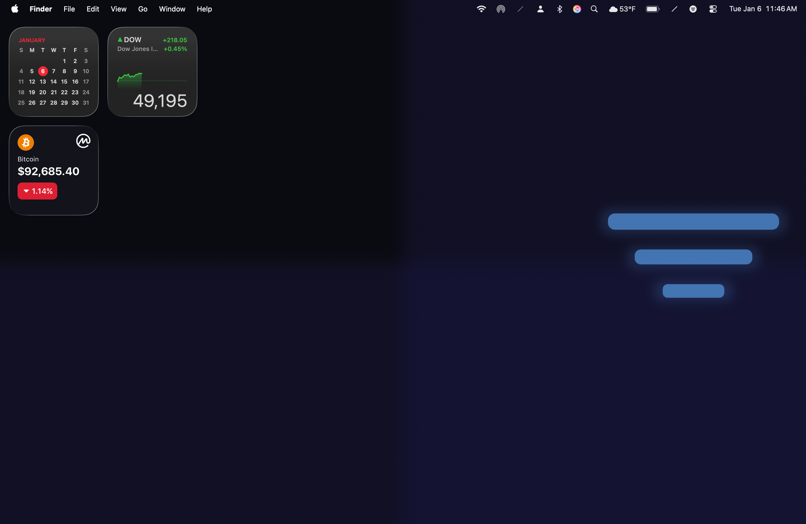
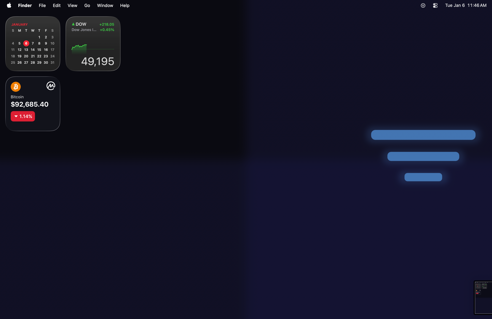

# SaneBar

**Clean up your Mac's menu bar in one click.**

Free. Private. No account needed.

| Icons Visible | Icons Hidden |
|---------------|--------------|
|  |  |

---

## Download

**[Download SaneBar](https://github.com/stephanjoseph/SaneBar/releases/download/v1.0.0/SaneBar-1.0.0.dmg)** (macOS 14+)

Or use Homebrew: `brew install --cask sanebar` *(coming soon)*

---

## How It Works

1. **Click** the SaneBar icon to show/hide your menu bar icons
2. **Cmd+drag** icons to choose which ones hide
3. That's it!

Icons to the **left** of SaneBar = always visible
Icons to the **right** of SaneBar = can be hidden

---

## Features

- **One-click hide/show** - Click to toggle
- **Hover to reveal** - Optional: show icons when you hover
- **Auto-hide** - Icons disappear after a delay
- **Keyboard shortcuts** - Control everything from the keyboard
- **WiFi triggers** - Auto-show icons on specific networks
- **Profiles** - Save different setups for work/home

Works great on MacBook Pro with notch.

---

## Privacy

**Your data stays on your Mac.** SaneBar makes zero network requests. No analytics. No telemetry. No account.

[Full privacy details](PRIVACY.md)

---

## Support

Free to use! If SaneBar helps you, leave a star on this repo.

## Donations

| | Address |
|---|---------|
| **BTC** | `3Go9nJu3dj2qaa4EAYXrTsTf5AnhcrPQke` |
| **SOL** | `FBvU83GUmwEYk3HMwZh3GBorGvrVVWSPb8VLCKeLiWZZ` |
| **ZEC** | `t1PaQ7LSoRDVvXLaQTWmy5tKUAiKxuE9hBN` |

---

## For Developers

<details>
<summary>Build from source</summary>

### Requirements
- macOS 14.0+
- Xcode 16+
- Ruby 3.0+
- [XcodeGen](https://github.com/yonaskolb/XcodeGen)

### Build

```bash
git clone https://github.com/stephanjoseph/SaneBar.git
cd SaneBar
bundle install
./Scripts/SaneMaster.rb verify
./Scripts/SaneMaster.rb launch
```

### Project Structure

```
SaneBar/
├── Core/           # Business logic, services
├── UI/             # SwiftUI views
├── Tests/          # Unit tests
└── Scripts/        # Build automation
```

</details>

<details>
<summary>AppleScript automation</summary>

```bash
osascript -e 'tell app "SaneBar" to toggle'
osascript -e 'tell app "SaneBar" to show hidden'
osascript -e 'tell app "SaneBar" to hide items'
```

</details>

<details>
<summary>The story</summary>

Built over a weekend pair programming with [Claude](https://claude.ai). Wanted a menu bar manager that wasn't $15, didn't phone home, and actually worked on macOS Tahoe.

</details>

---

## License

MIT - see [LICENSE](LICENSE)

[](https://claude.ai)
