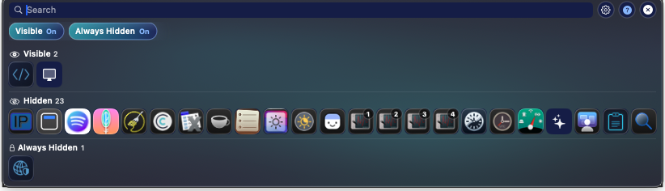
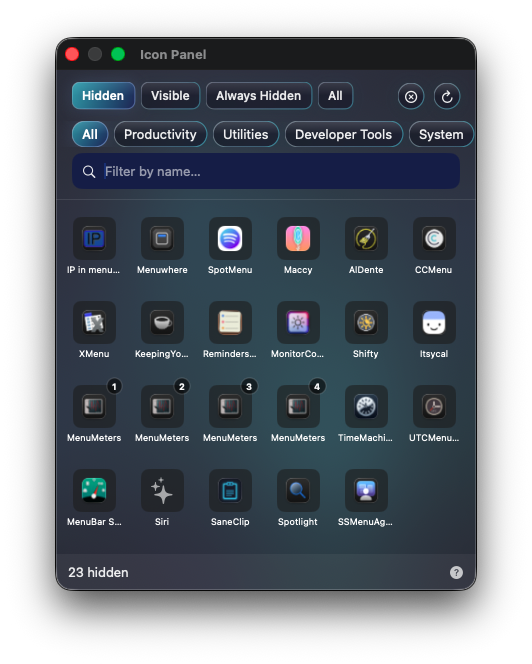
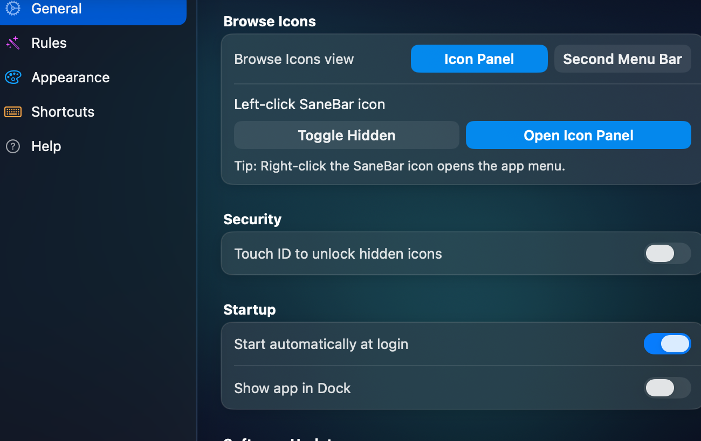

# SaneBar

[](https://github.com/sane-apps/SaneBar/stargazers)
[](LICENSE)
[](https://github.com/sane-apps/SaneBar/releases)
[](https://github.com/sane-apps/SaneBar/releases)
[](PRIVACY.md)
[-black)](https://github.com/serhii-londar/open-source-mac-os-apps)

> ### 🎉 SaneBar is now 100% free and open source
> Every Pro feature is unlocked for everyone — no license key, no trial, no strings. MIT licensed: use it, fork it, ship your own version. **[Read the full announcement](https://github.com/sane-apps/SaneBar/releases/tag/sunset)** for why (spoiler: macOS 27 breaks every menu bar manager) and what it means for you.
>
> SaneBar is community-maintained now. Found a bug and fixed it? **Pull requests are reviewed and merged** — see [Become a Contributor](#become-a-contributor-even-if-you-dont-code) below, even if you don't code.
>
> **⭐ [Star this repo](https://github.com/sane-apps/SaneBar/stargazers)** · **[Download](https://sanebar.com)** · **[Sponsor the developer](https://github.com/sponsors/MrSaneApps)**

<a href="https://www.producthunt.com/products/sanebar?utm_source=badge-featured&utm_medium=badge&utm_campaign=badge-sanebar" target="_blank"></a>

**Hide the apps. Keep the access.**

Hide menu bar apps you do not need right now, keep the important ones visible, and quickly open hidden apps when you need them. Free and open source — Touch ID lock, smart triggers, profiles, and everything else included.

| | |
|---|---|
| ⚡ **Power** | Your data stays on your Mac. No cloud account, no user-content upload. |
| ❤️ **Love** | Built to serve you. No dark patterns or manipulation. |
| 🧠 **Sound Mind** | Calm, focused design. No clutter or anxiety. |



| Icon Panel | Pick the view you like |
|---|---|
|  |  |
| Search by name, filter by section, and double-click to open hidden apps fast. | Use the Icon Panel or the Second Menu Bar. Switch anytime in Settings. |

▶️ **[Watch the demo](https://www.youtube.com/watch?v=I6U3APV-998)** (30 seconds)

[](https://www.youtube.com/watch?v=I6U3APV-998)

---

## Download

**SaneBar is free.** Everything is included — hide and show icons, Touch ID lock, smart triggers, profiles, custom styling, all of it. No license key, no trial, no subscription.

Current direct release: **2.1.89**.

Feel like paying anyway? **[GitHub Sponsors](https://github.com/sponsors/MrSaneApps)** is the tip jar — donations are what keep indie Mac software like this coming ([more ways to give](#support-development)).

### Install

```bash
# Homebrew (recommended)
brew install --cask sane-apps/tap/sanebar

# Already have SaneBar installed? Let Homebrew manage it:
brew install --cask --adopt sane-apps/tap/sanebar
```

Or **[download directly](https://sanebar.com)** · or [build from source](#for-developers)

**Requirements:** macOS 14.0+ (Sonoma or later), Apple Silicon (arm64) only

SaneBar updates itself automatically via Sparkle. `brew upgrade` works too if you prefer.

### What survives the sunset

- **[GitHub Releases](https://github.com/sane-apps/SaneBar/releases)** keeps release history and source snapshots. Old binary assets may be pruned; use the current signed build from sanebar.com.
- sanebar.com, the update feed, and the current direct-download host stay up on a best-effort basis. If they ever lapse, auto-updates and site downloads simply stop (updates are EdDSA-signed, so the failure mode is silence, not compromise).
- Forks that want their own auto-updates need their own Sparkle keys and feed URL — see [DEVELOPMENT.md](DEVELOPMENT.md).

---

## How It Works

1. **Click** the SaneBar icon to show or hide your hidden apps
2. **⌘+drag** in the menu bar to choose which apps stay visible
3. **Browse** hidden apps in the Icon Panel or the Second Menu Bar
4. **Double-click** any hidden app to open it fast

### Two Ways to View Hidden Icons

Choose the style that suits you — set it during onboarding or change anytime in Settings:

- **Icon Panel** — A compact floating view that is great for searching, filtering, and opening hidden apps fast.
- **Second Menu Bar** — A full-width row below the real menu bar, which is better when you want to see more apps at once.

Both modes let you browse hidden apps and open them, with drag reordering, drag moves between **Visible**, **Hidden**, and **Always Hidden**, plus right-click quick move actions.

---

## Features

### The Essentials

- **One-click hide/show** — Toggle visibility with a single click or hotkey (default: ⌘\)
- **⌘+drag to organize** — Choose which icons hide and which stay visible
- **Icon Panel or Second Menu Bar** — Two ways to view hidden icons (see above)
- **Open hidden apps fast** — Double-click apps from the Icon Panel or Second Menu Bar
- **Find Icon search** — Search any menu bar app by name, even behind the notch
- **Keyboard navigation** — Arrow keys, Enter to select, Escape to close
- **Auto-rehide** — Hidden icons automatically hide again after a delay
- **Crowded menu bar handling** — Inline reveal can temporarily hide app menus to make room when your menu bar is full
- **On-device by default** — No user-content upload. Network use is limited to updates and a few simple anonymous app counts.


### Power User Features

All included, free:

- **Touch ID / Password Lock** — The *only* menu bar manager that locks hidden icons behind biometrics. Protect crypto wallets, messaging tools, VPNs.
- **Always Hidden** — A dedicated section for icons you rarely need, only accessible via Find Icon or Second Menu Bar
- **Icon Activation & Zone Moves** — Click icons from panels to open their menus, move icons between Visible, Hidden, and Always-Hidden zones
- **Smart Triggers** — Auto-show on Focus Mode, Wi-Fi network, app launch, low battery, external monitor, or custom scripts
- **Profiles** — Save different setups for work, home, or presentations
- **Per-Icon Hotkeys** — Assign global shortcuts to instantly open any menu bar app's menu
- **Icon Groups** — Organize icons into custom named groups
- **Auto-hide Customization** — Custom timing, hide-on-app-change, external monitor rules
- **Gestures** — Hover to reveal, scroll to reveal, directional scroll
- **Custom Styling** — Tint, shadow, borders, rounded corners, custom menu bar icon (5 built-in styles or upload your own), light/dark mode tinting, extra dividers
- **Icon Spacing** — Reduce system-wide menu bar spacing to fit more icons before the Notch hides them
- **Liquid Glass** — Translucent styling ready for macOS 26 Tahoe
- **Import from Bartender or Ice** — Import Bartender layout plus matching settings, or bring over compatible Ice settings
- **Settings export/import** — Back up your settings, layout, custom icon, and saved profiles for another Mac
- **AppleScript automation** — Full scripting integration for Shortcuts and workflows


**All of it is free for everyone.** No trial, no license key — former paid customers don't need theirs anymore.

### Guided Onboarding

A first-run walkthrough gets you set up in under a minute:
1. **Welcome** — What SaneBar does, plus one-click import if Bartender or Ice is detected
2. **Try it** — Hide and show icons right away to see how it works
3. **Browse your icons** — See all your menu bar apps at a glance
4. **Choose your view** — Pick Icon Panel or Second Menu Bar
5. **Permissions** — Grant Accessibility access (required for menu bar management)
6. **Feature tour** — See everything included (it's all free)

Designed for Macs with a notch and crowded menu bars. **Private by default** — no account, no user-content upload, and only limited network requests for updates and a few simple anonymous app counts.

---

## Feature Details

### Find Icon Search
Search for any menu bar app by name and activate it — even if it's behind the notch.
1. **Option-click** the SaneBar icon, or use **Find Icon…** (default hotkey: ⌘⇧Space)
2. Type an app name and press **Return**
3. SaneBar will **virtually click** the app's menu bar item
4. Works even if the icon is physically hidden behind the notch or off-screen

### Crowded Menu Bars
If your menu bar is completely full, inline reveal can temporarily hide the front app's File/Edit/View menus to make room for hidden icons.
- The toggle lives in **Settings → Rules → Revealing**
- It is on by default
- It only affects inline reveal in the main menu bar
- It does not affect **Icon Panel** or **Second Menu Bar**

### Per-Icon Hotkeys
Assign a global hotkey to any menu bar app — press it and SaneBar instantly opens that app's menu.
1. Open **Find Icon…** → select an app → click **Record Shortcut** → press your key combo

### Always Hidden
Icons pinned here never show automatically — only accessible via Find Icon or Second Menu Bar.
- Right-click any icon → **Pin in Always Hidden**
- Unpin anytime from the same menu

### Smart Triggers
Auto-show or auto-hide based on context:
- **Low Battery** — Show when battery drops below threshold
- **App Launch** — Show when specific apps start
- **Wi-Fi Change** — Show on specific networks
- **Focus Mode** — Show when macOS Focus changes
- **App Change** — Auto-hide when you switch apps
- **External Monitor** — Always show on external displays
- **Script Trigger** — Run a custom script on a timer

### Icon Groups & Smart Categories
Organize your menu bar apps in the Find Icon window.
- **Icon Groups** — Create custom groups (e.g., "Work", "Media")
- **Smart Categories** — Automatic categorization by app type

---

## The Notch & 50+ Apps

**Worried about losing icons behind the notch?**

If you have 50+ apps, macOS might hide some of them behind the camera housing (the "Notch") or off-screen. SaneBar handles this gracefully:

1. **Hiding**: SaneBar pushes unused icons safely off-screen so your menu bar looks clean
2. **Safety Lock**: If SaneBar itself would get pushed off-screen, it refuses to hide to ensure you never lose control
3. **Find Icon**: Can't see an icon because it's behind the notch? Open **Find Icon…**, type the app name and hit Enter. SaneBar will find it and click it for you, even if it is not visible in the menu bar
4. **Tighter Icon Spacing**: Reduce system-wide menu bar spacing to fit more icons. Go to **Settings → Appearance** and enable "Reduce space between icons" (requires logout)

---

## Configuration

All settings are in the **Settings** window (click SaneBar icon → Settings, or press ⌘,).

| Tab | What's there |
|-----|--------------|
| **Control** | Launch at login, show in Dock, security (Touch ID/password lock), hiding options (second menu bar), software updates, saved profiles, import from Bartender/Ice, settings export/import, reset to defaults |
| **Rules** | Auto-hide behavior, revealing gestures (hover, scroll), automatic triggers (battery, apps, Wi-Fi, app change, external monitor) |
| **Appearance** | Custom menu bar icon, divider style, extra dividers, menu bar styling (tint, opacity per light/dark mode, shadow, border, corners), space analyzer, icon spacing |
| **Shortcuts** | Global keyboard shortcuts, AppleScript commands |
| **Health** | Menu bar health status, repair actions, layout rescue, diagnostics, stability/live mode |
| **License** | Confirms every feature is unlocked (SaneBar is free for everyone) |
| **About** | Version info, privacy badge, licenses, support, report issue |

### Icon Spacing (Settings → Appearance)

Reduce the spacing between **all** menu bar icons system-wide to fit more icons before they get hidden by the notch.

- **Enable**: Toggle "Reduce space between icons" in Appearance Settings
- **Defaults**: Ships with notch-friendly values (spacing=4, padding=4)
- **Logout required**: macOS reads these settings at login, so you must log out and back in for changes to take effect
- **Reversible**: Disable the toggle and log out to restore default spacing

---

## Privacy

**Your data stays on your Mac.** SaneBar does not upload your files, menu bar contents, or personal content. Network use is limited to updates and a few simple anonymous app counts such as app version, build, OS version, channel, and update availability.


[Full privacy details](PRIVACY.md)

---

## Support Development

SaneBar used to cost $14.99. Now it's 100% free and MIT licensed — no paywall, no catch. If it saves your menu bar (and your sanity), a donation is the new price tag, and you set it:

**❤️ [Sponsor on GitHub](https://github.com/sponsors/MrSaneApps)** — the single best way to support this app and keep future SaneApps coming.

**⭐ [Star the repo](https://github.com/sane-apps/SaneBar)** if SaneBar helps you. Stars are free and help others discover quality indie software.

**If SaneBar helps you, star the repo.** Stars are free and help others discover quality indie software.

### Crypto Donations

Prefer crypto? These work too:

| | Address |
|---|---------|
| **BTC** | `3Go9nJu3dj2qaa4EAYXrTsTf5AnhcrPQke` |
| **SOL** | `FBvU83GUmwEYk3HMwZh3GBorGvrVVWSPb8VLCKeLiWZZ` |
| **ZEC** | `t1PaQ7LSoRDVvXLaQTWmy5tKUAiKxuE9hBN` |

---

## More from the same developer

If SaneBar earned a spot on your Mac, these solve other everyday annoyances the same way — on-device by default, pay once, no subscription:

| App | What it does |
|-----|--------------|
| **[SaneClip](https://saneclip.com)** | Clipboard history that stays private — Touch ID lock, instant search, OCR, and quick text tools. The natural companion to a tidy menu bar. |
| **[SaneClick](https://saneclick.com)** | Useful right-click actions in Finder — convert files, run scripts, merge PDFs — all on-device, no Automator. |
| **[SaneHosts](https://sanehosts.com)** | Block ads and trackers system-wide with a simple local hosts manager. |

See everything at **[saneapps.com](https://saneapps.com)**.

---

## For Developers

<details>
<summary>Build from source</summary>

### Requirements
- Xcode 16+ (needs macOS Sequoia or later to build; the app runs on macOS 14.0+)
- Apple Silicon (arm64) only
- Ruby 3.0+ (for the helper scripts; no gems needed)
- [XcodeGen](https://github.com/yonaskolb/XcodeGen) — only if you add or remove source files

### Build

```bash
git clone https://github.com/sane-apps/SaneBar.git
cd SaneBar
./Scripts/SaneMaster.rb verify    # builds + runs tests
./Scripts/SaneMaster.rb launch    # build and run
```

**External contributors:** `SaneMaster.rb` works standalone — no monorepo required. If the shared infrastructure isn't found, it falls back to `Scripts/SaneMaster_standalone.rb`, which wraps plain `xcodebuild`. You can also build manually:

```bash
xcodebuild -scheme SaneBar -configuration Debug build
```

### Project Structure

```
SaneBar/
├── Core/                   # Business logic
│   ├── Services/           # AccessibilityService, HoverService, etc.
│   ├── Controllers/        # StatusBarController, SettingsController
│   └── Models/             # Data models
├── UI/                     # SwiftUI views
│   ├── Settings/           # Modular settings tabs
│   ├── SearchWindow/       # Find Icon, Second Menu Bar
│   └── Onboarding/         # Welcome wizard
├── Tests/                  # Swift Testing unit tests
├── Scripts/                # Build automation and QA helpers (SaneMaster.rb)
└── project.yml             # XcodeGen configuration
```

</details>

<details>
<summary>AppleScript automation</summary>

```bash
# Toggle hidden items
osascript -e 'tell app "SaneBar" to toggle'

# Show hidden items
osascript -e 'tell app "SaneBar" to show hidden'

# Hide items
osascript -e 'tell app "SaneBar" to hide items'

# List all menu bar icons
osascript -e 'tell app "SaneBar" to list icons'

# Pin an icon to the Always Hidden zone
osascript -e 'tell app "SaneBar" to hide icon "com.example.app"'

# Unpin from the Always Hidden zone
osascript -e 'tell app "SaneBar" to show icon "com.example.app"'
```

</details>

<details>
<summary>The story</summary>

Built pair programming with [Claude](https://claude.ai). Wanted a menu bar manager that wasn't $15, didn't spy on me, and actually worked. Now the whole thing is free and open source for everyone.

</details>

<details>
<summary>Documentation for contributors</summary>

| Document | Purpose |
|----------|---------|
| [README.md](README.md) | Product overview and doc map |
| [ARCHITECTURE.md](ARCHITECTURE.md) | System design, runtime model, and key decisions |
| [PRIVACY.md](PRIVACY.md) | Privacy practices and limited network behavior |
| [CONTRIBUTING.md](CONTRIBUTING.md) | How to contribute |
| [SECURITY.md](SECURITY.md) | Security policy and reporting |
| [CHANGELOG.md](CHANGELOG.md) | Version history |
| [GitHub Issues](https://github.com/sane-apps/SaneBar/issues) | Bug reports and tracking |
| [DEVELOPMENT.md](DEVELOPMENT.md) | Development rules and SOP |
| [docs/NOTCH_MOVE_LIMITATION.md](docs/NOTCH_MOVE_LIMITATION.md) | Why notch-stuck icons can't be moved on macOS 26 (proven platform limit + the privacy trade-off we declined) |

</details>

---

## Why SaneBar?

| Feature | SaneBar | Bartender | Ice | Hidden Bar |
|---------|---------|-----------|-----|------------|
| **Touch ID / Password Lock** | Yes | No | No | No |
| **Smart Triggers** | Yes | No | No | No |
| **Guided Onboarding** | Yes | No | No | No |
| **Import from Bartender/Ice** | Bartender layout + Ice settings | No | No | No |
| **Always Hidden** | Yes | No | Yes | No |
| **Gesture Controls** | Yes | Yes | Yes | No |
| **Second Menu Bar** | Yes | Yes | Yes | No |
| **Find Icon Search** | Yes | Yes | Yes | No |
| **AppleScript** | Yes | Yes | No | No |
| **100% Transparent Code** | [MIT](LICENSE) | No | Yes | Yes |
| **On-Device by Default** | Yes | No (telemetry) | Yes | Yes |
| **Pricing** | Free (open source, MIT) | $16 | Free | Free |
| **Active Development** | Community-maintained (PRs welcome) | Yes | Yes | Abandoned |

## License

[MIT License](https://opensource.org/license/mit) — see [LICENSE](LICENSE)

Copyright (c) 2025-2026 SaneApps. As of June 2026, SaneBar is free and fully open source under the MIT License: use it, fork it, modify it, redistribute it, even commercially. No restrictions.

### License FAQ

**Can I fork SaneBar for any use?** Yes.

**Can I study the code, audit it, or submit pull requests?** Yes.

**Can I build on or redistribute this code, even commercially?** Yes. SaneBar is now MIT licensed, which is fully permissive. The only requirement is that you keep the copyright and license notice.

## Third-Party Notices

Third-party open-source attributions are documented in [THIRD_PARTY_NOTICES.md](THIRD_PARTY_NOTICES.md).

<!-- SANEAPPS_AI_CONTRIB_START -->
### Become a Contributor (Even if You Don't Code)

Are you tired of waiting on the dev to get around to fixing your problem?  
Do you have a great idea that could help everyone in the community, but think you can't do anything about it because you're not a coder?

Good news: you actually can.

Copy and paste this into Claude or Codex, then describe your bug or idea:

```text
I want to contribute to this repo, but I'm not a coder.

Repository:
https://github.com/sane-apps/SaneBar

Bug or idea:
[Describe your bug or idea here in plain English]

Please do this for me:
1) Understand and reproduce the issue (or understand the feature request).
2) Make the smallest safe fix.
3) Open a pull request to https://github.com/sane-apps/SaneBar with a short
   summary of what changed and why in the PR description.
4) Give me the pull request link.

Important:
- Keep it focused on this one issue/idea.
- Do not make unrelated changes.
- Do not open a GitHub issue — new issues are auto-closed; the pull request
  itself is the report.
```

Pull requests are reviewed and tested before merge.

If your PR is merged, you get public credit, and the satisfaction of knowing you helped ship a fix for everyone.
<!-- SANEAPPS_AI_CONTRIB_END -->
