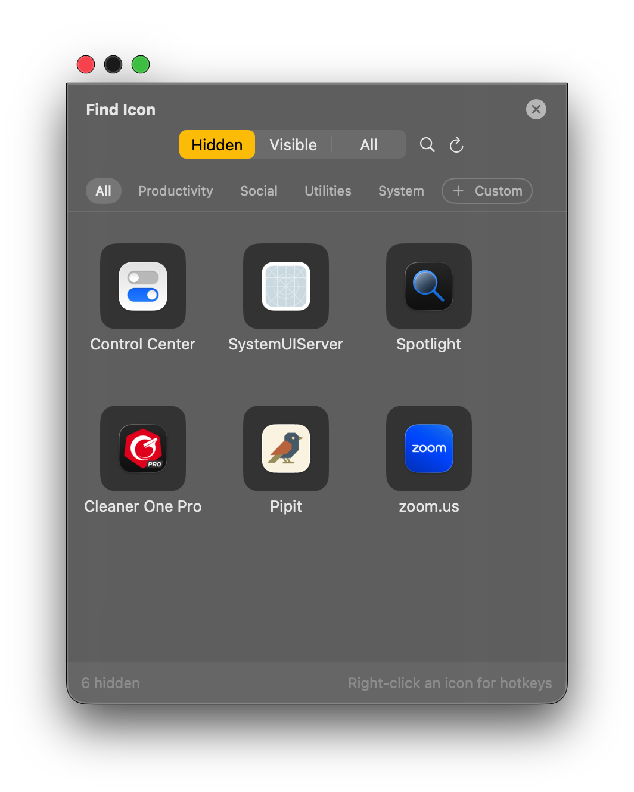
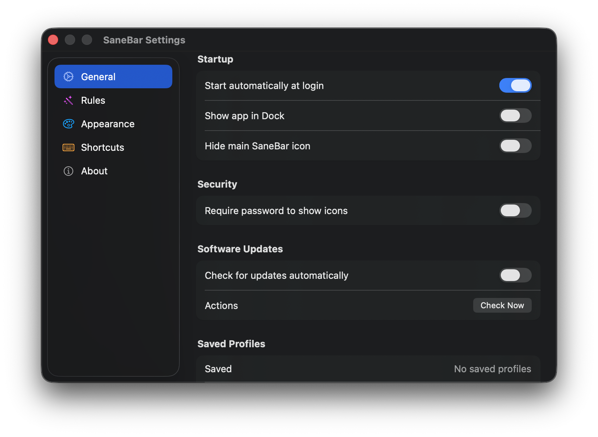
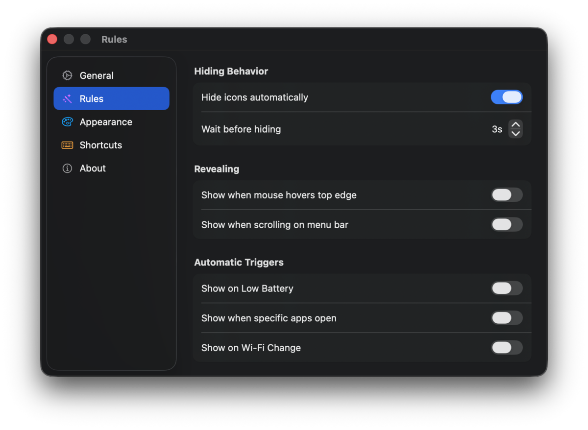
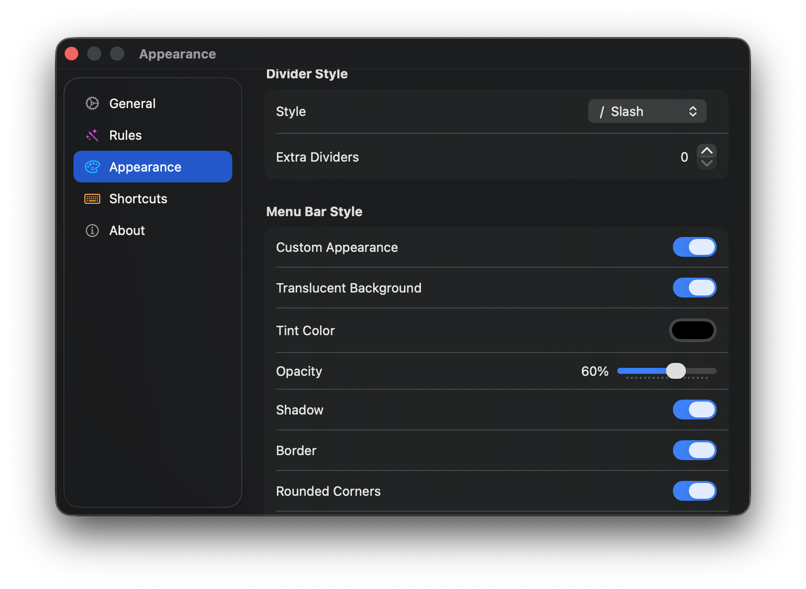
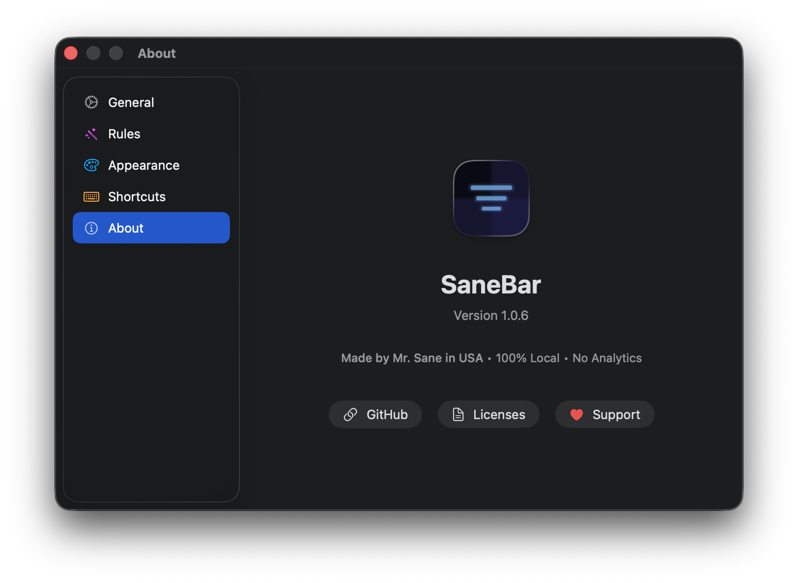

# SaneBar

[](https://github.com/sane-apps/SaneBar/stargazers)
[](LICENSE)
[](https://github.com/sane-apps/SaneBar/releases)
[](https://github.com/sane-apps/SaneBar/releases)
[](PRIVACY.md)
[-black)](https://github.com/serhii-londar/open-source-mac-os-apps)

> **⭐ Star this repo if it's useful!** · **[Download Basic](https://sanebar.com)** · **[Upgrade to Pro — $6.99](https://sanebar.com)** · Keeps development alive

<a href="https://www.producthunt.com/products/sanebar?utm_source=badge-featured&utm_medium=badge&utm_campaign=badge-sanebar" target="_blank"></a>

**Your menu bar. Not theirs.**

Hide icons. Show them when you need them. That's it. Basic is $0, with optional Pro features for power users.

| | |
|---|---|
| ⚡ **Power** | Your data stays on your device. No cloud, no tracking. |
| ❤️ **Love** | Built to serve you. No dark patterns or manipulation. |
| 🧠 **Sound Mind** | Calm, focused design. No clutter or anxiety. |

▶️ **[Watch the demo](https://www.youtube.com/watch?v=I6U3APV-998)** (30 seconds)

[](https://www.youtube.com/watch?v=I6U3APV-998)



---

## Download

**SaneBar Basic is $0.** Hide and show icons, browse your menu bar, search for any icon — all included.

Want more? **[Upgrade to Pro ($6.99 once)](https://sanebar.com)** for Touch ID lock, smart triggers, profiles, custom styling, and more. One-time purchase, no subscriptions.

### Install

```bash
# Homebrew (recommended)
brew install --cask sane-apps/tap/sanebar

# Already have SaneBar installed? Let Homebrew manage it:
brew install --cask --adopt sane-apps/tap/sanebar
```

Or **[download directly](https://sanebar.com)** · or [build from source](#for-developers)

**Requirements:** macOS 15 Sequoia or later, Apple Silicon (arm64) only

SaneBar updates itself automatically via Sparkle. `brew upgrade` works too if you prefer.

---

## How It Works

1. **Click** the SaneBar icon to show/hide your hidden menu bar icons
2. **⌘+drag** icons to choose which ones hide
3. That's it. Most people stop here.

### Two Ways to View Hidden Icons

Choose the style that suits you — set it during onboarding or change anytime in Settings:

- **Icon Panel** — A floating panel appears below the menu bar showing your hidden icons. Clean, compact, click to dismiss.
- **Second Menu Bar** — A full secondary bar stretches across the screen below your menu bar, showing all hidden icons in their natural order.

Both modes support left-click icon activation in Basic.
Pro unlocks drag reordering, drag moves between **Visible**, **Hidden**, and **Always-Hidden**, plus right-click quick move actions.

---

## Features

### Basic — $0, Everything You Need

- **One-click hide/show** — Toggle visibility with a single click or hotkey (default: ⌘\)
- **⌘+drag to organize** — Choose which icons hide and which stay visible
- **Icon Panel or Second Menu Bar** — Two ways to view hidden icons (see above)
- **Find Icon search** — Search any menu bar app by name, even behind the Notch
- **Keyboard navigation** — Arrow keys, Enter to select, Escape to close
- **Auto-rehide** — Hidden icons automatically hide again after a delay
- **Crowded menu bar handling** — Inline reveal can temporarily hide app menus to make room when your menu bar is full
- **100% on-device** — No analytics. No telemetry. No network requests. Verify with Little Snitch: zero connections.



### Pro — Power User Features ($6.99 once)

Everything in Basic, plus:

- **Touch ID / Password Lock** — The *only* menu bar manager that locks hidden icons behind biometrics. Protect crypto wallets, messaging tools, VPNs.
- **Always-Hidden Zone** — A dedicated zone for icons you rarely need, only accessible via Find Icon or Second Menu Bar
- **Icon Activation & Zone Moves** — Click icons from panels to open their menus, move icons between Visible, Hidden, and Always-Hidden zones
- **Smart Triggers** — Auto-show on Focus Mode, Wi-Fi network, app launch, low battery, external monitor, or custom scripts
- **Profiles** — Save different setups for work, home, or presentations
- **Per-Icon Hotkeys** — Assign global shortcuts to instantly open any menu bar app's menu
- **Icon Groups** — Organize icons into custom named groups
- **Auto-hide Customization** — Custom timing, hide-on-app-change, external monitor rules
- **Gestures** — Hover to reveal, scroll to reveal, directional scroll
- **Custom Styling** — Tint, shadow, borders, rounded corners, custom menu bar icon (5 built-in styles or upload your own), light/dark mode tinting, extra dividers
- **Icon Spacing** — Reduce system-wide menu bar spacing to fit more icons before the Notch hides them
- **Liquid Glass** — Translucent styling ready for macOS 26 Tahoe
- **Import from Bartender or Ice** — Migrate your existing layout automatically
- **Settings export/import** — Back up your config and restore on another Mac
- **AppleScript automation** — Full scripting integration for Shortcuts and workflows




**Existing users before v1.5** automatically get lifetime Pro as early adopters. No action needed.

### Guided Onboarding

A first-run walkthrough gets you set up in under a minute:
1. **Welcome** — What SaneBar does, automatic import if Bartender or Ice is detected
2. **Try it** — Hide and show icons right away to see how it works
3. **Browse your icons** — See all your menu bar apps at a glance
4. **Choose your view** — Pick Icon Panel or Second Menu Bar
5. **Permissions** — Grant Accessibility access (required for menu bar management)
6. **Basic vs Pro** — See what's included and what Pro unlocks

Works perfectly on Macs with Notch. **100% private** — no network requests, no analytics, no account.

---

## Feature Details

### Find Icon Search
Search for any menu bar app by name and activate it — even if it's behind the Notch.
1. **Option-click** the SaneBar icon, or use **Find Icon…** (default hotkey: ⌘⇧Space)
2. Type an app name and press **Return**
3. SaneBar will **virtually click** the app's menu bar item
4. Works even if the icon is physically hidden behind the Notch or off-screen

### Crowded Menu Bars
If your menu bar is completely full, inline reveal can temporarily hide the front app's File/Edit/View menus to make room for hidden icons.
- The toggle lives in **Settings → Rules → Revealing**
- It is on by default
- It only affects inline reveal in the main menu bar
- It does not affect **Icon Panel** or **Second Menu Bar**

### Per-Icon Hotkeys *(Pro)*
Assign a global hotkey to any menu bar app — press it and SaneBar instantly opens that app's menu.
1. Open **Find Icon…** → select an app → click **Record Shortcut** → press your key combo

### Always-Hidden Zone *(Pro)*
Icons pinned here never show automatically — only accessible via Find Icon or Second Menu Bar.
- Right-click any icon → **Pin in Always Hidden**
- Unpin anytime from the same menu

### Smart Triggers *(Pro)*
Auto-show or auto-hide based on context:
- **Low Battery** — Show when battery drops below threshold
- **App Launch** — Show when specific apps start
- **Wi-Fi Change** — Show on specific networks
- **Focus Mode** — Show when macOS Focus changes
- **App Change** — Auto-hide when you switch apps
- **External Monitor** — Always show on external displays
- **Script Trigger** — Run a custom script on a timer

### Icon Groups & Smart Categories
Organize your menu bar apps in the Find Icon window.
- **Icon Groups** — Create custom groups (e.g., "Work", "Media")
- **Smart Categories** — Automatic categorization by app type

---

## The Notch & 50+ Apps

**Worried about losing icons behind the Notch?**

If you have 50+ apps, macOS might hide some of them behind the camera housing (the "Notch") or off-screen. SaneBar handles this gracefully:

1. **Hiding**: SaneBar pushes unused icons safely off-screen so your menu bar looks clean
2. **Safety Lock**: If SaneBar itself would get pushed off-screen, it refuses to hide to ensure you never lose control
3. **Find Hidden Icon**: Can't see an icon because it's behind the Notch? Open **Find Icon…**, type the app name and hit Enter. SaneBar will find it and click it for you, even if it's invisible
4. **Tighter Icon Spacing**: Reduce system-wide menu bar spacing to fit more icons. Go to **Settings → Appearance** and enable "Reduce space between icons" (requires logout)

---

## Configuration

All settings are in the **Settings** window (click SaneBar icon → Settings, or press ⌘,).

| Tab | What's there |
|-----|--------------|
| **General** | Launch at login, show in Dock, security (Touch ID/password lock), hiding options (second menu bar), software updates, saved profiles, import from Bartender/Ice, settings export/import, reset to defaults |
| **Rules** | Auto-hide behavior, revealing gestures (hover, scroll), automatic triggers (battery, apps, Wi-Fi, app change, external monitor) |
| **Appearance** | Custom menu bar icon, divider style, extra dividers, menu bar styling (tint, opacity per light/dark mode, shadow, border, corners), space analyzer, icon spacing |
| **Shortcuts** | Global keyboard shortcuts, AppleScript commands |
| **About** | Version info, privacy badge, licenses, support, report issue |

### Icon Spacing (Settings → Appearance)

Reduce the spacing between **all** menu bar icons system-wide to fit more icons before they get hidden by the notch.

- **Enable**: Toggle "Reduce space between icons" in Appearance Settings
- **Defaults**: Ships with notch-friendly values (spacing=4, padding=4)
- **Logout required**: macOS reads these settings at login, so you must log out and back in for changes to take effect
- **Reversible**: Disable the toggle and log out to restore default spacing

---

## Privacy

**Your data stays on your Mac.** SaneBar makes zero network requests. No analytics. No telemetry. No account.



[Full privacy details](PRIVACY.md)

---

## Support

**⭐ [Star the repo](https://github.com/sane-apps/SaneBar)** if SaneBar helps you. Stars help others discover quality indie software.

**Cloning without starring?** For real bro? Gimme that star!
### Donations

| | Address |
|---|---------|
| **BTC** | `3Go9nJu3dj2qaa4EAYXrTsTf5AnhcrPQke` |
| **SOL** | `FBvU83GUmwEYk3HMwZh3GBorGvrVVWSPb8VLCKeLiWZZ` |
| **ZEC** | `t1PaQ7LSoRDVvXLaQTWmy5tKUAiKxuE9hBN` |

---

## For Developers

<details>
<summary>Build from source</summary>

### Requirements
- macOS 15.0+ (Sequoia or later)
- Apple Silicon (arm64) only
- Xcode 16+
- Ruby 3.0+
- [XcodeGen](https://github.com/yonaskolb/XcodeGen)

### Build

```bash
git clone https://github.com/sane-apps/SaneBar.git
cd SaneBar
./scripts/SaneMaster.rb verify    # builds + runs tests
./scripts/SaneMaster.rb launch    # build and run
```

**External contributors:** `SaneMaster.rb` works standalone — no monorepo required. If the shared infrastructure isn't found, it falls back to direct `xcodebuild` commands. You can also build manually:

```bash
xcodebuild -scheme SaneBar -configuration Debug build
```

### Project Structure

```
SaneBar/
├── Core/                   # Business logic
│   ├── Services/           # AccessibilityService, HoverService, etc.
│   ├── Controllers/        # StatusBarController, SettingsController
│   └── Models/             # Data models
├── UI/                     # SwiftUI views
│   ├── Settings/           # Modular settings tabs
│   ├── SearchWindow/       # Find Icon, Second Menu Bar
│   └── Onboarding/         # Welcome wizard
├── Tests/                  # Swift Testing unit tests
├── scripts/                # Build automation (SaneMaster.rb)
└── project.yml             # XcodeGen configuration
```

</details>

<details>
<summary>AppleScript automation</summary>

```bash
# Toggle hidden items
osascript -e 'tell app "SaneBar" to toggle'

# Show hidden items
osascript -e 'tell app "SaneBar" to show hidden'

# Hide items
osascript -e 'tell app "SaneBar" to hide items'

# List all menu bar icons
osascript -e 'tell app "SaneBar" to list icons'

# Pin an icon to always-hidden zone
osascript -e 'tell app "SaneBar" to hide icon "com.example.app"'

# Unpin from always-hidden zone
osascript -e 'tell app "SaneBar" to show icon "com.example.app"'
```

</details>

<details>
<summary>The story</summary>

Built pair programming with [Claude](https://claude.ai). Wanted a menu bar manager that wasn't $15, didn't spy on me, and actually worked. Now Basic is $0 for everyone.

</details>

<details>
<summary>Documentation for contributors</summary>

| Document | Purpose |
|----------|---------|
| [CONTRIBUTING.md](CONTRIBUTING.md) | How to contribute |
| [SECURITY.md](SECURITY.md) | Security policy and reporting |
| [CHANGELOG.md](CHANGELOG.md) | Version history |
| [GitHub Issues](https://github.com/sane-apps/SaneBar/issues) | Bug reports and tracking |
| [DEVELOPMENT.md](DEVELOPMENT.md) | Development rules and SOP |

</details>

---

## Why SaneBar?

| Feature | SaneBar | Bartender | Ice | Hidden Bar |
|---------|---------|-----------|-----|------------|
| **Touch ID / Password Lock** | Yes | No | No | No |
| **Smart Triggers** | Yes | No | No | No |
| **Guided Onboarding** | Yes | No | No | No |
| **Import from Bartender/Ice** | Yes | No | No | No |
| **Always-Hidden Zone** | Yes | No | Yes | No |
| **Gesture Controls** | Yes | Yes | Yes | No |
| **Second Menu Bar** | Yes | Yes | Yes | No |
| **Find Icon Search** | Yes | Yes | Yes | No |
| **AppleScript** | Yes | Yes | No | No |
| **100% Transparent Code** | [PolyForm Shield](LICENSE) | No | Yes | Yes |
| **100% On-Device** | Yes | No (telemetry) | Yes | Yes |
| **Pricing** | Basic ($0) / Pro $6.99 | $16 | Free | Free |
| **Active Development** | Yes | Yes | Yes | Abandoned |

## License

[PolyForm Shield 1.0.0](https://polyformproject.org/licenses/shield/1.0.0) — see [LICENSE](LICENSE)

Copyright (c) 2025-2026 SaneApps. 100% transparent code — read, audit, and learn from it. Use it for anything except building a competing product.

## Third-Party Notices

Third-party open-source attributions are documented in [THIRD_PARTY_NOTICES.md](THIRD_PARTY_NOTICES.md).

<!-- SANEAPPS_AI_CONTRIB_START -->
### Become a Contributor (Even if You Don't Code)

Are you tired of waiting on the dev to get around to fixing your problem?  
Do you have a great idea that could help everyone in the community, but think you can't do anything about it because you're not a coder?

Good news: you actually can.

Copy and paste this into Claude or Codex, then describe your bug or idea:

```text
I want to contribute to this repo, but I'm not a coder.

Repository:
https://github.com/sane-apps/SaneBar

Bug or idea:
[Describe your bug or idea here in plain English]

Please do this for me:
1) Understand and reproduce the issue (or understand the feature request).
2) Make the smallest safe fix.
3) Open a pull request to https://github.com/sane-apps/SaneBar
4) Give me the pull request link.
5) Open a GitHub issue in https://github.com/sane-apps/SaneBar/issues/new?template=bug_report.md that includes:
   - the pull request link
   - a short summary of what changed and why
6) Also give me the exact issue link.

Important:
- Keep it focused on this one issue/idea.
- Do not make unrelated changes.
```

If needed, you can also just email the pull request link to hi@saneapps.com.

I review and test every pull request before merge.

If your PR is merged, I will publicly give you credit, and you'll have the satisfaction of knowing you helped ship a fix for everyone.
<!-- SANEAPPS_AI_CONTRIB_END -->
