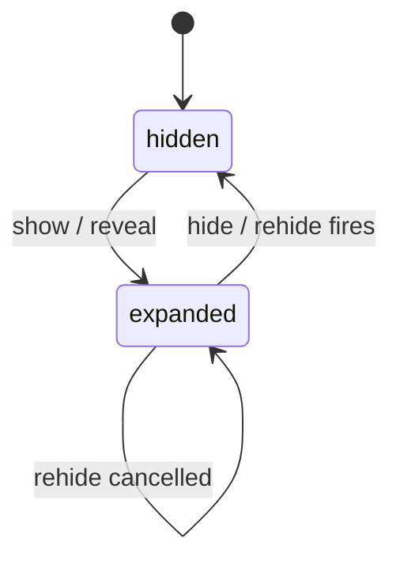
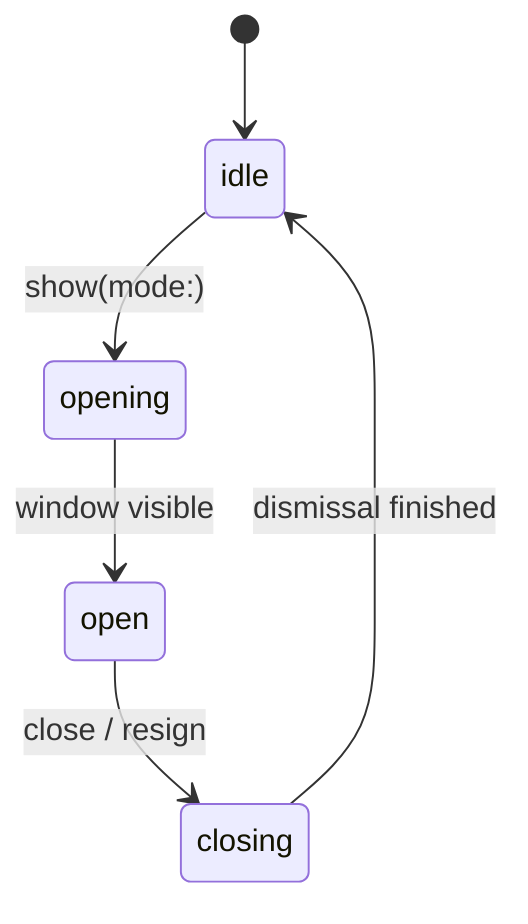
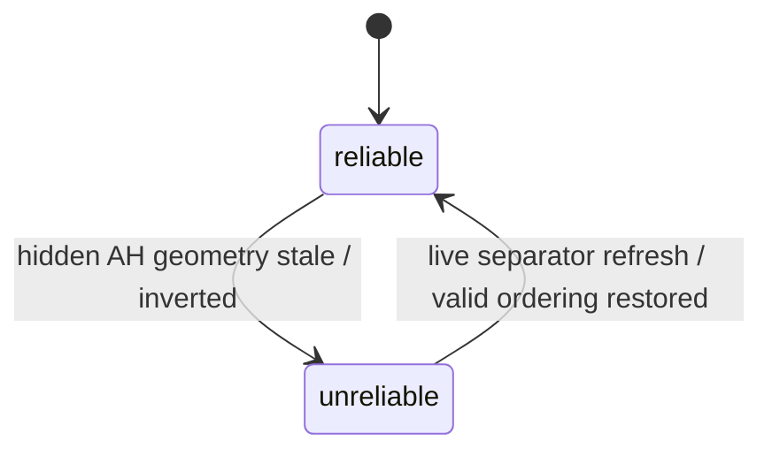
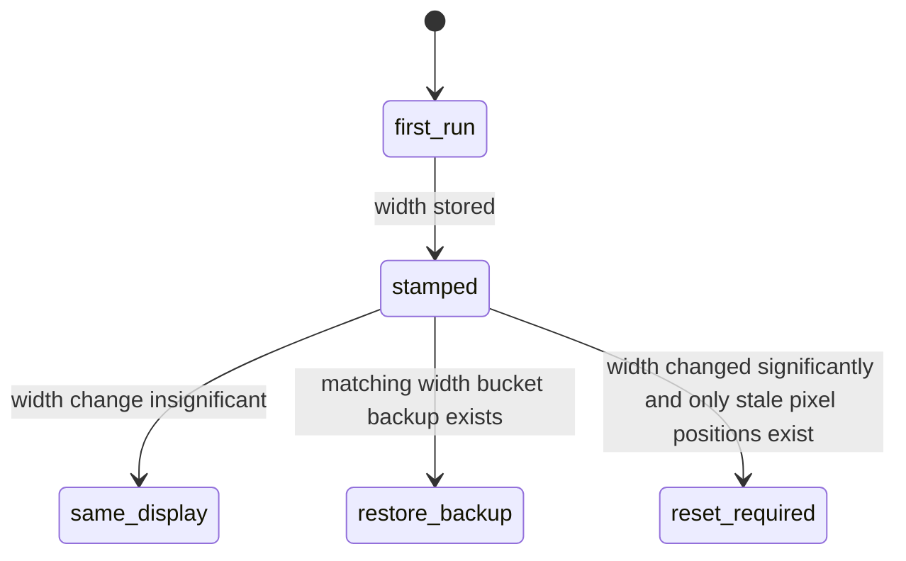
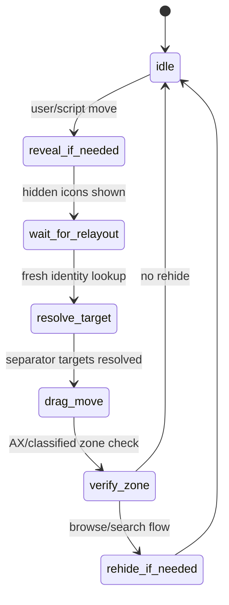

# Menu Bar Runtime Playbook

Start here when SaneBar has a persistent menu bar regression.

This file is the single debugging entry point for:
- hide/show state bugs
- Browse Icons / second menu bar regressions
- icon move / zone classification failures
- display-change / update / restart resets
- menu-extra discovery gaps

Use this together with:
- `docs/DEBUGGING_MENU_BAR_INTERACTIONS.md` for lower-level positioning notes
- `docs/state-machines.md` for the older full-system diagrams
- `docs/E2E_TESTING_CHECKLIST.md` for broader release coverage

## Canonical Runtime Path

For scripted launches and live smoke on development machines and on Mini:
- runtime app path: `/Applications/SaneBar.app`
- runtime process path: `/Applications/SaneBar.app/Contents/MacOS/SaneBar`
- runtime bundle id for smoke: `com.sanebar.app`

Everything else is a build artifact, not a launch target:
- `DerivedData/.../SaneBar.app`
- `codex-runs/.../SaneBar.app`
- archive export bundles
- stray `/Applications/SaneBar.app` copies from older sessions

`sane_test.rb` is expected to:
- stage the newest build into `/Applications/SaneBar.app`
- trash non-canonical copies before verification
- launch only that canonical bundle

As of March 6, 2026, `./scripts/SaneMaster.rb test_mode --release` is also expected to:
- prefer the real `Release` configuration
- preserve any signed `/Applications/SaneBar.app` install if headless signing forces an unsigned fallback build
- stage unsigned fallback builds into `~/Applications/SaneBar.app`
- verify that the launched process path matches the bundle it just staged

Do not validate runtime behavior with raw `ssh mini 'cd ... && xcodebuild ...'` or raw `ssh mini '... ./scripts/SaneMaster.rb ...'` from a stale remote repo checkout.
Run `./scripts/SaneMaster.rb ...` from the local workspace root so Mini-first routing syncs the current local tree first.

`Scripts/live_zone_smoke.rb` should be run with explicit target env vars so it does not fall back to Finder / Launch Services name resolution.

## Canonical Regression Buckets

Treat repeated bug reports as one of these runtime families, not as isolated issues.

### R1. Move / classification drift

Symptoms:
- move icon returns success but lands in the wrong zone
- hidden <-> always hidden moves fail intermittently
- separator geometry looks inverted or stale

Primary code:
- `Core/MenuBarManager+IconMoving.swift`
- `Core/Services/SearchService.swift`
- `Core/Services/AppleScriptCommands.swift`
- `Core/Services/LayoutSnapshotGeometry.swift`

### R2. Browse panel / rehide race

Symptoms:
- Browse Icons opens and immediately becomes unusable
- ghost cursor reports during browse interactions
- second menu bar or icon panel fights with auto-rehide
- app activation while opening the panel schedules a hide

Primary code:
- `UI/SearchWindow/SearchWindowController.swift`
- `Core/MenuBarManager+Visibility.swift`
- `Core/MenuBarManager.swift`

### R3. Display reset / persistence drift

Symptoms:
- layout resets after update, restart, or monitor change
- visible icons go back to defaults
- stale pixel positions survive after moving to a new display width

Primary code:
- `Core/Controllers/StatusBarController.swift`

### R4. Settings / expectation mismatch

Symptoms:
- user expects one browse mode but another is active
- auto-rehide behavior surprises the user
- Always Hidden behavior is interpreted as a move bug

Primary code:
- settings UI
- diagnostics output
- onboarding / import behavior

This bucket is real, but do not let it hide R1-R3.

### R5. Detection / host-model gaps

Symptoms:
- app never appears in Find Icons or owner/config lists
- app is missing from scan output even though its menu presence is visible on-screen
- logs show `AXExtrasMenuBar` unavailable and no usable fallback item model

Primary code:
- `Core/Services/AccessibilityService+Scanning.swift`
- `Core/Services/AccessibilityService+MenuExtras.swift`
- `Core/Services/AccessibilityService+Cache.swift`
- `Core/Services/BartenderImportService.swift`

Known examples:
- Little Snitch
- Time Machine
- older “disappearing icons / not in Find Icons” reports where the app had no standard AX extras bar

## The Actual Runtime Model

The persistent bugs were not one bug. They came from 5 state machines drifting out of sync.

### 1. Visibility state



Source of truth:
- `MenuBarManager.hidingService.state`

Key rule:
- A rehide timer is only valid if no browse session is active and no move is in progress.

### 2. Browse session state



Source of truth:
- `SearchWindowController.shared.isBrowseSessionActive`
- `SearchWindowController.shared.isVisible`
- `SearchWindowController.shared.isMoveInProgress`

Key rule:
- `isBrowseSessionActive` is earlier and more reliable than `isVisible` during open/close transitions.

### 3. Geometry confidence state



Important distinction:
- raw separator values are not always trustworthy
- hidden-state Always Hidden geometry is intentionally treated as unreliable

Key rule:
- never force a move or smoke invariant from raw AH geometry when the bar is hidden

### 4. Persistence / display-width state



Key rule:
- pixel-like positions from a different display width must not be treated as trustworthy layout state

### 5. Move pipeline state



Key rule:
- move verification must escalate from cached zones to a refreshed classification snapshot before declaring failure

## Official Apple API Ground Truth

Verified against Apple documentation on March 5, 2026.

- `NSStatusItem.autosaveName` is only a unique identifier for saving and restoring a status item. Apple does not document pixel semantics or conflict resolution. Use it as identity, not as proof that a stored position is still valid.
- `NSWorkspace.didActivateApplicationNotification` includes the activated `NSRunningApplication` in `userInfo[applicationUserInfoKey]`. Filtering SaneBar self-activation is therefore the correct way to avoid false app-change rehide.
- `NSScreen.auxiliaryTopRightArea` is the unobscured top-right portion of the screen outside the safe area on obscured displays. It is the right reference point for notch/control-center drift checks.
- `UserDefaults.persistentDomain(forName:)` returns only the app domain, not merged defaults. Use app-domain snapshots for forensics and replay instead of reasoning from mixed defaults output.

## Root Causes Fixed In This Cycle

### Fixed: separator normalization for move targeting

What was wrong:
- move verification could trust stale separator boundaries

What changed:
- live main separator right edge is normalized before cache/verification
- Always Hidden separator boundaries are normalized against the main separator before move targeting

Proof:
- Mini smoke passed
- direct AppleScript move round-trip passed

### Fixed: hidden-state Always Hidden snapshot mismatch

What was wrong:
- snapshot logic treated raw Always Hidden coordinates as authoritative while hidden
- runtime classification already knew that geometry was unreliable in that state

What changed:
- layout snapshot now normalizes AH geometry and marks reliability explicitly

Proof:
- Mini smoke no longer fails on false layout-invariant checks

### Fixed: Browse Icons self-activation rehide race

What was wrong:
- `NSApp.activate(ignoringOtherApps: true)` during browse opening could trip app-change rehide logic
- fire-time rehide checks also trusted `isVisible` too early

What changed:
- app-change rehide now skips SaneBar self-activation
- app-change rehide now skips active browse sessions
- fire-time rehide now blocks on `isBrowseSessionActive` before `isVisible`
- search-triggered rehide defers while the browse session is active or visible

Proof:
- Mini browse script kept the panel open with:
  - `rehideOnAppChange = true`
  - `isBrowseSessionActive = true`
  - `isBrowseVisible = true`
  - `hidingState = expanded`

### Fixed: display backup restore path locked down

What was wrong:
- stale pixel positions after width changes were easy to regress

What changed:
- restore-vs-reset behavior is now covered by initialization tests

Proof:
- full Mini verify includes the restore path coverage

## Current Open Lead

What was closed during the March 6, 2026 Mini pass:
- the old `click succeeded` false-positive lead was real
- browse-origin activation can now verify a real post-click effect instead of trusting the posted click alone
- multi-item bundles were also mis-targeted when a stale `statusItemIndex` overrode a correct live X-position

What changed:
- new AppleScript browse commands can force `.browsePanel` origin directly
- click verification now requires an observable post-click reaction
- status-item resolution now falls back from a stale `statusItemIndex` to nearest-center matching when the live coordinates disagree
- when a precise system-wide menu extra replaces a coarse bundle fallback, positional status-item resolution now survives an identifier miss instead of failing closed
- precise system-wide menu extras now replace coarse same-bundle fallbacks instead of rendering duplicate rows like `Spotlight` + `com.apple.menuextra.spotlight`

Mini proof after the fix:
- `Stats::statusItem:2` was the failing browse-origin case before the patch
- the same live matrix now succeeds for:
  - `Stats::statusItem:0`
  - `Stats::statusItem:1`
  - `Stats::statusItem:2`
  - `Stats::statusItem:3`
  - `Wi-Fi`
  - `Spotlight`

What is still open:
- external confirmation is still needed from the GitHub `#101` / `#105` class of reporter machines
- R5 detection/host-model gaps remain open for apps that never expose a usable AX menu-extra item at all

Separate live detection lead on March 6, 2026:
- installed Little Snitch 6.3.3 on Mini
- `at.obdev.littlesnitch.networkmonitor` is a top-bar host candidate
- SaneBar now detects that host and attempts third-party `AXMenuBar` fallback
- current live result is still `items=0`, so Little Snitch remains unresolved in item-position scanning
- quitting `/Applications/SaneBar.app` and sweeping the raw system-wide menu bar still does not surface a Little Snitch AX item
- `defaults read at.obdev.littlesnitch menuBarExtraIsShown` is `1` on Mini, so this is not just a hidden-state preference mismatch
- launching `/Applications/Little Snitch.app/Contents/Components/Little Snitch Network Monitor.app` directly still produces:
  - no `AXExtrasMenuBar`
  - no `AXMenuBar`
  - no system-wide AX hit-test samples for any `littlesnitch` bundle at the menu-bar y-coordinate
- `at.obdev.littlesnitch.networkmonitor` does own multiple full-width top-bar windows, so the remaining gap is host modeling / OS exposure, not app launch state
- latest mitigation is owner-only fallback in `SearchService.refreshMenuBarApps()`, which keeps this class visible in broad discovery even when macOS will not provide coordinates

What that means:
- owner-list coverage and item-position coverage are different problems
- do not close Little Snitch/Time Machine style reports as “same as second menu bar click bug”
- if logs show `Top-bar host AXMenuBar fallback ... items=0`, the remaining problem is deeper than stale targets or rehide timing
- if system-wide hit-testing still finds nothing with SaneBar quit, the remaining problem is outside SaneBar's hide/show state machine

## Known Tricky App Matrix

Keep at least one live or synthetic check for each of these before calling detection fixed:
- Little Snitch: helper/top-bar host with no normal `AXExtrasMenuBar`
- Time Machine: system-hosted special-case detection
- one app with multiple status items under one bundle (`Stats`)
- one Apple menu extra with unstable AX identity (`Spotlight` or `Wi-Fi`)
- one notch-hidden item that only becomes reachable after reveal

Important interpretation rule:
- repeated identical-looking icons in Hidden are not automatically a duplication bug
- `Stats` legitimately exposes multiple menu extras under one bundle, so one hidden row can contain several nearly identical `Stats` icons
- on March 6, 2026 the Mini screenshot that looked like "Little Snitch 6-7 times" was actually four `Stats` items plus other normal hidden icons
- the duplicate-looking `Spotlight` entry was a real merge bug and should now collapse to the precise `com.apple.menuextra.spotlight` entry when the second menu bar is open

Do not mark R5 fully closed until this is explained or fixed.

## Current Hotspots To Audit First

If a new regression appears, read these in this order:

1. `Core/MenuBarManager+Visibility.swift`
2. `UI/SearchWindow/SearchWindowController.swift`
3. `Core/MenuBarManager.swift`
4. `Core/MenuBarManager+IconMoving.swift`
5. `Core/Services/SearchService.swift`
6. `Core/Controllers/StatusBarController.swift`
7. `Core/Services/AppleScriptCommands.swift`
8. `Core/Services/LayoutSnapshotGeometry.swift`

## Signed Build Trust Matrix

Treat these runtime targets differently.

| Target | Bundle ID | Typical trust/TCC state | Use for | Do not use for |
|------|------|------|------|------|
| Fresh Debug build in DerivedData | `com.sanebar.dev` | Usually no Accessibility grant unless manually staged | browse/rehide probes, prefs-restore replay, layout snapshot checks | final click/move smoke unless AX trust is confirmed |
| Trusted dev install in `/Applications/SaneBar.app` | usually `com.sanebar.app` or manually staged dev build | usable for real move smoke when AX trust is already granted | hidden/visible/AH round-trips, live smoke | proving a brand-new signed artifact |
| Fresh `ProdDebug` build | `com.sanebar.app` | should match release behavior, but trust only after codesign is clean | pre-release smoke once Sparkle/framework signing succeeds | assumptions while Sparkle signing is failing |
| Public release artifact after install | `com.sanebar.app` | actual customer path | final release confidence and customer repro confirmation | developer-only probes that depend on extra script commands |

Current blocker:
- Mini `ProdDebug` was still failing Sparkle codesign with `errSecInternalComponent`, so release confidence should stay below "fully proven" until that artifact passes the same smoke.
- Mini Accessibility trust can also fail at the system TCC layer even when the app row is visible in System Settings. On March 5, 2026 both `com.sanebar.app` and `com.sanebar.dev` were present in `/Library/Application Support/com.apple.TCC/TCC.db` with `auth_value=0`, which left AppleScript and live AX probes denied until the row was re-enabled through the password-gated `Modify Settings` sheet.

## Reporter Prefs Forensics

When a customer says "nothing changed" across releases, stop guessing and clone the app domain.

### Capture

1. Export only the app domain:

```bash
defaults export com.sanebar.app - > sanebar-defaults.plist
```

2. Capture immediately after repro:
- in-app bug report
- `layout snapshot`
- `list icon zones`

3. Keep these diagnostics fields:
- `prefsForensics`
- `nsStatusItemPreferredPositions`
- `settings`

### Replay

Use the debug bundle id to avoid touching the production install:

```bash
defaults import com.sanebar.dev sanebar-defaults.plist
open -a ~/Library/Developer/Xcode/DerivedData/.../Build/Products/Debug/SaneBar.app
```

Then compare:
- current width bucket backups
- stored width bucket backups
- legacy always-hidden key
- whether launch restores a width-matched backup or resets to ordinals

### What To Look For

- `NSStatusItem Preferred Position SaneBar_AlwaysHiddenSeparator` still present with a tiny value
- stale pixel-like main/separator values paired with a different calibrated width
- current-width backup keys present but ignored
- hidden items unexpectedly becoming Always Hidden after first launch

Bartender residue is still only a hypothesis. Prefer proving or disproving SaneBar-domain state first.

## Stale Settings Checklist

Before calling something a "random old settings problem", check these explicitly:

- current `autosaveVersion`
- current main/separator/AH preferred positions
- legacy non-versioned Always Hidden separator key
- calibrated screen width
- current screen width and screen count
- current-width display backup keys
- stored-width display backup keys
- pinned Always Hidden ids count
- whether the first launch after reinstall moves items to Always Hidden before any user action

## Mini Repro Pack

Install these on Mini before chasing menu-bar regressions:

```bash
brew install --cask shottr stats hiddenbar
brew install cliclick mas
```

What each one is for:
- `Shottr`: third-party menu extra with screenshot-style behavior
- `Stats`: multi-item menu extra host
- `Hidden Bar`: another hide/show menu bar implementation to compare against
- `cliclick`: fallback UI automation when AppleScript element targeting is too brittle
- `mas`: App Store CLI for future repro apps that are App Store-only

Current notes:
- `Klack` was not available through Homebrew during this pass, so treat it as manual/App Store install territory.
- `Shottr`, `Stats`, and `Hidden Bar` can install cleanly but still remain background-only until their own onboarding is completed.
- `cliclick` was already present on Mini before this pass.

## Mini Screenshot Path That Actually Works

Direct screenshot tools launched from the SSH shell were not reliable on Mini during the March 6 pass:
- plain `screencapture` from SSH could fail with `could not create image from display`
- ad-hoc `ScreenCaptureKit` helpers were denied by TCC
- Shottr deep links and guessed hotkeys were not reliable enough for repeatable automation

The working path was to ask the active GUI `Terminal` app to run `screencapture`:

```bash
ssh mini 'osascript -e '\''tell application "SaneBar" to show second menu bar'\'' >/dev/null; sleep 1; osascript <<'\''APPLESCRIPT'\'' 
tell application "Terminal"
  do script "screencapture -x $HOME/Desktop/Screenshots/sanebar-open.png"
end tell
APPLESCRIPT
sleep 2
ls -l ~/Desktop/Screenshots/sanebar-open.png'
```

Use this when the test requires proof that the menu bar actually opened and rendered the expected icons.

## Mini Accessibility / TCC Recovery

Do not trust the user-level TCC database alone for Accessibility. On Mini, the meaningful rows for SaneBar were in:

```bash
sqlite3 /Library/Application\ Support/com.apple.TCC/TCC.db \
  "select client,auth_value,auth_reason,auth_version,length(csreq) \
   from access \
   where service='kTCCServiceAccessibility' and client like 'com.sanebar%';"
```

Interpretation:
- `auth_value=2`: granted
- `auth_value=0`: explicitly denied

Observed failure shape on March 5, 2026:
- System Settings showed two `SaneBar` rows in Accessibility
- both checkboxes could be flipped to `1`
- AppleScript still returned `Accessibility permission is required`
- the real blocker was the password-gated sheet with buttons `Modify Settings` and `Cancel`
- until that password sheet is completed, the system TCC row stays denied

Useful Mini checks:

```bash
ssh mini 'open "x-apple.systempreferences:com.apple.preference.security?Privacy_Accessibility"'
ssh mini 'osascript -e '\''tell application "System Events" to tell process "System Settings" to get name of every button of every sheet of window "Accessibility"'\'''
ssh mini 'sqlite3 /Library/Application\ Support/com.apple.TCC/TCC.db "select client,auth_value from access where service='\''kTCCServiceAccessibility'\'' and client like '\''com.sanebar%'\'';"'
```

What this means for confidence:
- if the system TCC row is denied, Mini cannot be used for honest end-to-end SaneBar click/move proof
- unit tests can still pass, but live confidence must stay capped until the password-gated grant is completed

## Mini Verification Commands

These are the commands that mattered for this fix cycle.

### 1. Full suite

```bash
./scripts/SaneMaster.rb verify
```

What it proves:
- build still works
- unit/integration coverage still passes

### 2. Trusted app live smoke

```bash
SANEBAR_SMOKE_REQUIRE_ALWAYS_HIDDEN=1 ruby ./Scripts/live_zone_smoke.rb
```

What it proves:
- real move actions work end to end on Mini
- hidden/visible/always-hidden transitions still behave

Prerequisite:
- `com.sanebar.app` must already be Accessibility-granted at the system TCC layer

### 2a. Signed canonical release-path smoke

```bash
./scripts/SaneMaster.rb test_mode --release --no-logs
```

What it proves:
- the signed `Release` build is the one staged into `/Applications/SaneBar.app`
- Launch Services and Finder resolve the same canonical bundle that runtime smoke will hit

Prerequisite:
- the local codesign environment must be healthy enough to build and stage the `Release` app

### 2b. Release preflight runtime gate

```bash
./scripts/SaneMaster.rb release_preflight
```

What it now proves before release:
- the normal preflight checks still run
- when Mini can sign, a staged `Release` app is launched on Mini
- when Mini cannot sign, QA falls back to the signed `/Applications/SaneBar.app` install for release-style smoke
- `live_zone_smoke.rb` runs against the chosen release-style target, not whichever bundle happened to launch last
- screenshot artifacts are required only for the browse modes that target bundle actually exposes
- the smoke passes twice in one QA run: cold launch, then immediate repeat
- `/tmp/sanebar_runtime_smoke.log` keeps the actual browse activation diagnostics when a pass fails

Why the repeat pass matters:
- a single pass can succeed while pass 2 still exposes second-menu-bar browse activation drift
- the current failure shape is `finalOutcome: workspace activation fallback` plus `verification=failed (no observable menu/panel reaction)` while the browse panel still reports `currentMode: secondMenuBar`, `windowVisible: true`, and `lastRelayoutReason: refit`

### 3. Trusted app direct move round-trip

Use path-targeted AppleScript against:
- `/Applications/SaneBar.app`

Round-trip:
- hidden -> visible -> hidden -> always hidden -> hidden

What it proves:
- move commands and classified zones agree

Prerequisite:
- AppleScript commands must no longer return `Accessibility permission is required`

### 4. Debug-build browse rehide probe

Use path-targeted AppleScript against the fresh Debug build:
- `~/Library/Developer/Xcode/DerivedData/.../Build/Products/Debug/SaneBar.app`

Sequence:
- `hide items`
- `show second menu bar`
- wait
- `layout snapshot`
- `close browse panel`
- `layout snapshot`

Expected open snapshot:
- `hidingState = expanded`
- `isBrowseSessionActive = true`
- `isBrowseVisible = true`
- `rehideOnAppChange = true`

This is the proof that the browse panel no longer loses to self-activation rehide.

### 4a. Debug-build browse-origin activation probe

Use the debug or staged canonical app, then run:

```applescript
tell application "SaneBar"
    show second menu bar
    activate browse icon "eu.exelban.Stats::statusItem:2"
end tell
```

Variants:
- `right click browse icon "<id>"`
- use `Wi-Fi`, `Spotlight`, and another `Stats` item in the same matrix

What it proves:
- the browse panel path is using `.browsePanel` activation origin
- multi-item target resolution still works after relayout instead of trusting a stale `statusItemIndex`

### 5. Debug-build prefs restore replay

Use the debug bundle id so the real install stays untouched.

Seed:
- stale main/separator positions
- mismatched stored width
- matching-width backup keys for the current display

Then launch the debug app and confirm:
- main/separator restore to the current-width backup
- calibrated width stamps to the current display

What it proves:
- restore beats ordinal reset on the real launch path

## Known Tooling Trap

Mini `ProdDebug` build can fail before runtime verification with:
- Sparkle framework codesign failure
- `errSecInternalComponent`

That is a signing/toolchain issue, not the menu bar regression itself.

When that happens:
1. keep logic verification on Mini Debug for browse/session checks
2. keep move/smoke verification on the trusted installed app
3. fix signing separately

Also note:
- before March 6, 2026, `test_mode --release` could silently build `Release` and then still launch the `ProdDebug` path
- if old notes say "`test_mode --release` is unreliable", that was true then and no longer should be true after the `sanemaster/test_mode.rb` fix

## Triage Rules

When a new report comes in:

1. Put it in one of `R1-R5`.
2. Capture `layout snapshot` and `list icon zones` first.
3. Do not close it until the original reporter confirms on their machine.
4. If the bug mentions:
   - monitor change
   - update
   - restart
   - restore
   start in `StatusBarController.swift`
5. If the bug mentions:
   - browse
   - second menu bar
   - ghost cursor
   - panel opens then closes
   start in `SearchWindowController.swift` and `MenuBarManager+Visibility.swift`
6. If the bug mentions:
   - moved but landed wrong
   - always hidden drift
   - move succeeded but zone is wrong
   start in `MenuBarManager+IconMoving.swift` and `SearchService.swift`
7. If the bug mentions:
   - never appears in Find Icons
   - helper-hosted menu extra
   - Little Snitch
   - Time Machine
   start in `AccessibilityService+Scanning.swift`, `AccessibilityService+SystemWideScanning.swift`, and `SearchService+Diagnostics.swift`

## Exit Criteria

Do not call a persistent regression fixed unless all of these are true:

1. The root cause is named in one of `R1-R5`.
2. The code path is covered by at least one focused test.
3. The Mini full suite passes.
4. At least one Mini runtime check passes on the real interaction path.
5. The verification command is written down here so the next person can rerun it.
