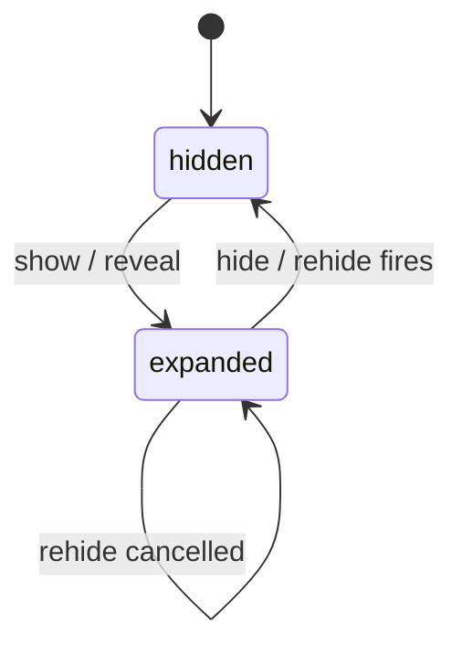
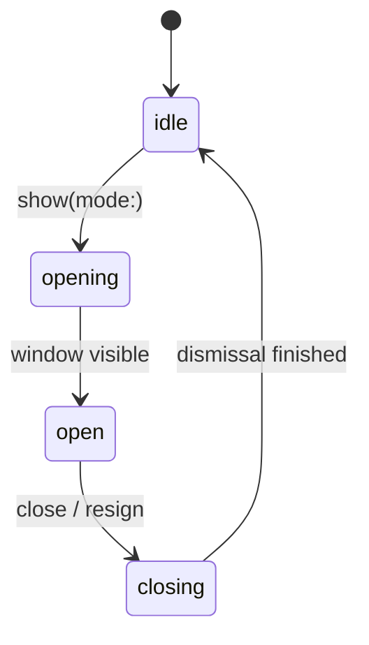
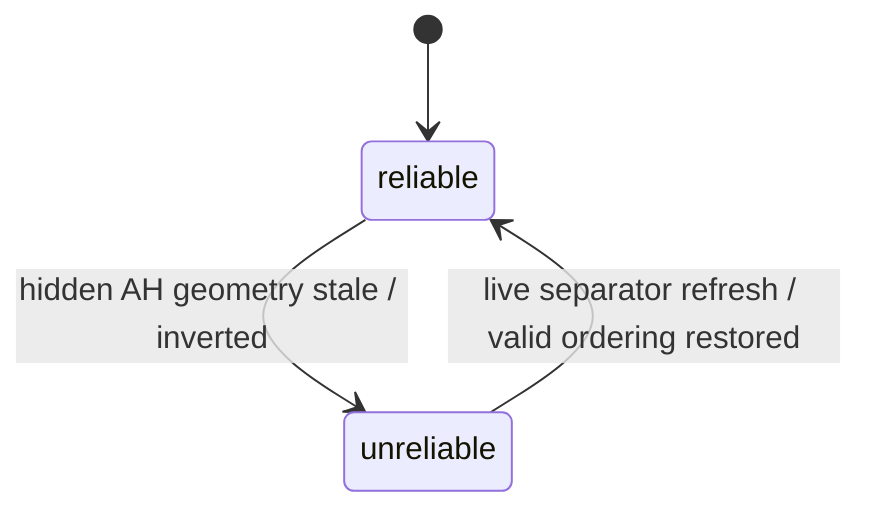
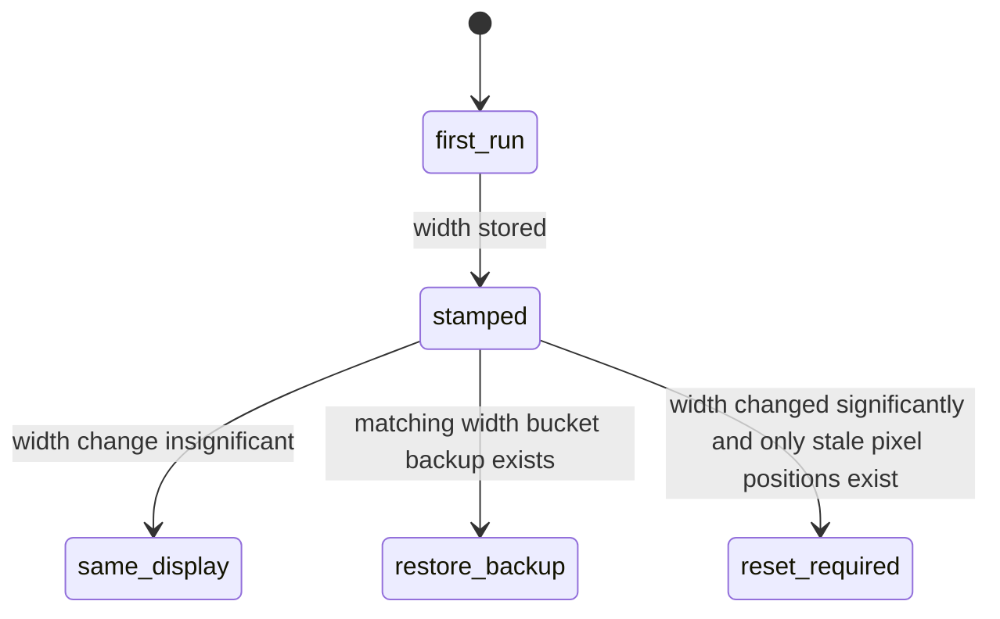
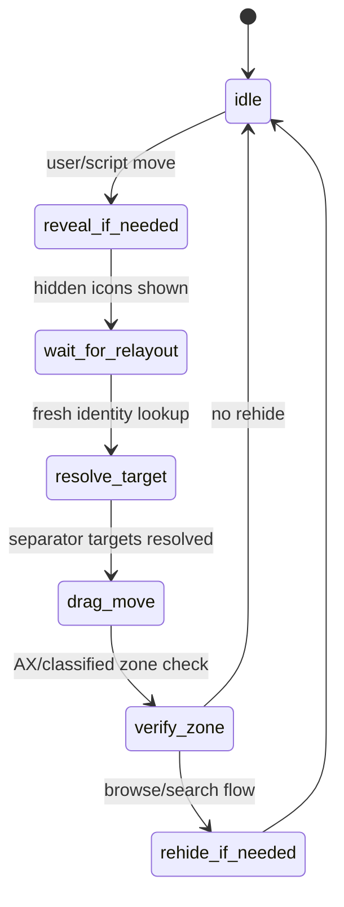
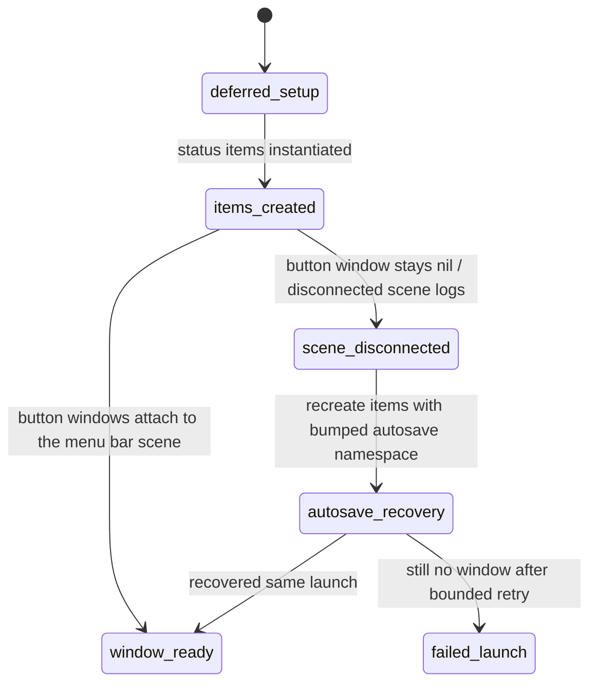

# Menu Bar Runtime Playbook

Start here when SaneBar has a persistent menu bar regression.

This file is the single debugging entry point for:
- hide/show state bugs
- Browse Icons / second menu bar regressions
- icon move / zone classification failures
- display-change / update / restart resets
- menu-extra discovery gaps

Use this together with:
- `docs/DEBUGGING_MENU_BAR_INTERACTIONS.md` for lower-level positioning notes
- `ARCHITECTURE.md` for the full-system runtime model
- `docs/E2E_TESTING_CHECKLIST.md` for broader release coverage

## Canonical Runtime Path

For scripted launches and live smoke on development machines:
- runtime app path: `/Applications/SaneBar.app`
- runtime process path: `/Applications/SaneBar.app/Contents/MacOS/SaneBar`
- runtime bundle id for smoke: `com.sanebar.app`

Everything else is a build artifact, not a launch target:
- `DerivedData/.../SaneBar.app`
- `codex-runs/.../SaneBar.app`
- archive export bundles
- stray `/Applications/SaneBar.app` copies from older sessions

`Scripts/live_zone_smoke.rb` should be run with explicit target env vars so it does not fall back to Finder / Launch Services name resolution.

## Canonical Regression Buckets

Treat repeated bug reports as one of these runtime families, not as isolated issues.

### R1. Move / classification drift

Symptoms:
- move icon returns success but lands in the wrong zone
- hidden <-> always hidden moves fail intermittently
- separator geometry looks inverted or stale

Primary code:
- `Core/MenuBarManager+IconMoving.swift`
- `Core/Services/SearchService.swift`
- `Core/Services/AppleScriptCommands.swift`
- `Core/Services/LayoutSnapshotGeometry.swift`

### R2. Browse panel / rehide race

Symptoms:
- Browse Icons opens and immediately becomes unusable
- ghost cursor reports during browse interactions
- second menu bar or icon panel fights with auto-rehide
- app activation while opening the panel schedules a hide

Primary code:
- `UI/SearchWindow/SearchWindowController.swift`
- `Core/MenuBarManager+Visibility.swift`
- `Core/MenuBarManager.swift`

### R3. Display reset / persistence drift

Symptoms:
- layout resets after update, restart, or monitor change
- visible icons go back to defaults
- stale pixel positions survive after moving to a new display width

Primary code:
- `Core/Controllers/StatusBarController.swift`

### R4. Settings / expectation mismatch

Symptoms:
- user expects one browse mode but another is active
- auto-rehide behavior surprises the user
- Always Hidden behavior is interpreted as a move bug

Primary code:
- settings UI
- diagnostics output
- onboarding / import behavior

This bucket is real, but do not let it hide R1-R3.

### R5. Detection / host-model gaps

Symptoms:
- app never appears in Find Icons or owner/config lists
- app is missing from scan output even though its menu presence is visible on-screen
- logs show `AXExtrasMenuBar` unavailable and no usable fallback item model

Primary code:
- `Core/Services/AccessibilityService+Scanning.swift`
- `Core/Services/AccessibilityService+MenuExtras.swift`
- `Core/Services/AccessibilityService+Cache.swift`
- `Core/Services/BartenderImportService.swift`

Known examples:
- Little Snitch
- Time Machine
- older “disappearing icons / not in Find Icons” reports where the app had no standard AX extras bar

### R6. Startup scene / status-item bootstrap failure

Symptoms:
- process is alive but no SaneBar icon or separator ever appears
- launch preferences exist, but the status items never render
- shortcuts or other startup interaction surfaces appear dead
- Console shows disconnected status-bar scene errors on Tahoe-class systems

Primary code:
- `Core/MenuBarManager.swift`
- `Core/Controllers/StatusBarController.swift`

Key rule:
- a missing status-item window is not a healthy startup state; it must trigger recovery instead of being treated as “not ready yet”

Current root cause note:
- if `MenuBarManager` eagerly constructs the default `StatusBarController` during init, the `NSStatusItem`s are created before the deferred startup delay and before the headless guard actually matters
- the runtime-safe path is: defer default `StatusBarController` creation until `setupStatusItem()`, validate both main + separator window attachment, and allow a bounded second recovery pass for Tahoe-class disconnected scenes

### R7. Dock policy drift / activation churn

Symptoms:
- Dock icon appears even though `showDockIcon` is off
- issue often follows inline reveal or temporary app-menu suppression
- Console can show `NSApplication._react(to:) dock`

Primary code:
- `Core/MenuBarManager+Visibility.swift`
- `Core/Services/UpdateService.swift`

Key rule:
- when `showDockIcon` is off, activation side effects must not be allowed to leave SaneBar visible in the Dock

## Live GitHub Issue Map

Use this table before replying, closing, or opening another issue. Keep one primary bucket per issue even if the logs show secondary symptoms.

| Issue | State | Primary bucket | Why it belongs there | Notes |
|------|------|------|------|------|
| `#111` | open | `R3` | Reporter says arranged icons and saved profiles do not restore; later follow-up and linked diagnostics place it in the startup/persistence collapse family | Use as the older public anchor for the reset family |
| `#113` | open | `R3` | Visible items later collapse back into hidden and diagnostics show the `main=0 / separator=1` shape | Same family as `#111/#114/#115` |
| `#114` | open | `R3` | Main icon and separator relaunch too far left of Control Center after login | Same family, stronger multi-display/login wording |
| `#115` | open | `R3` | Fresh March 18 report says reset still happens while the app is already open, not just at startup | Treat as the newest live public reset-family thread |
| `#116` | open | `R2` | Right-click browse flashes, sometimes needs a second click, and focus can jump back to a prior app/window | Canonical live browse focus / activation thread |
| `#117` | open | `R1` | Hidden-visible add can beachball and the wrong Control Center-family icon can move instead of the requested one | Canonical live move / identity-drift thread |
| `#109` | closed | `R1` | Earlier browse/move mismatch thread with undercount and move-failure evidence on 2.1.24 | Historical anchor for the broader move/browse cluster |
| `#108` | closed | `R5` | Browse undercount proved a real detection/data-pipeline mismatch on an earlier build | Historical anchor for detection gaps |
| `#107` | open | `R6` | Tahoe report: process alive, no icon/separator render, disconnected scene logs | Separate startup/bootstrap bucket |
| `#94` | open | `R5` | Residual app-specific detection/activation failures after broader move fixes | Keep separate from the current `#117` move family |

Practical rule:
- `#111/#113/#114/#115` should be treated as one active startup/persistence family until proven otherwise.
- `#116` is the live public reference for right-click browse focus/activation regressions.
- `#117` is the live public reference for wrong-target move / hidden-visible add regressions.
- `#109` and `#108` are older evidence, not the current public reference threads.
- `#94` remains the public reference for app-specific host-model / detection fallout.
- `#107` remains the public reference for startup scene/bootstrap failures on Tahoe-class systems.
- Do not tell users to open a brand-new issue if the symptom clearly matches one of these buckets.

## The Actual Runtime Model

The persistent bugs were not one bug. They came from 6 state machines drifting out of sync.

### 1. Visibility state



Source of truth:
- `MenuBarManager.hidingService.state`

Key rule:
- A rehide timer is only valid if no browse session is active and no move is in progress.

### 2. Browse session state



Source of truth:
- `SearchWindowController.shared.isBrowseSessionActive`
- `SearchWindowController.shared.isVisible`
- `SearchWindowController.shared.isMoveInProgress`

Key rule:
- `isBrowseSessionActive` is earlier and more reliable than `isVisible` during open/close transitions.

### 3. Geometry confidence state



Important distinction:
- raw separator values are not always trustworthy
- hidden-state Always Hidden geometry is intentionally treated as unreliable

Key rule:
- never force a move or smoke invariant from raw AH geometry when the bar is hidden

### 4. Persistence / display-width state



Key rule:
- pixel-like positions from a different display width must not be treated as trustworthy layout state

### 5. Move pipeline state



Key rule:
- move verification must escalate from cached zones to a refreshed classification snapshot before declaring failure

### 6. Startup scene readiness state



Key rule:
- startup validation must treat a missing status-item window as broken state, not just “not ready yet”

## Official Apple API Ground Truth

Verified against Apple documentation on March 5, 2026.

- `NSStatusItem.autosaveName` is only a unique identifier for saving and restoring a status item. Apple does not document pixel semantics or conflict resolution. Use it as identity, not as proof that a stored position is still valid.
- `NSWorkspace.didActivateApplicationNotification` includes the activated `NSRunningApplication` in `userInfo[applicationUserInfoKey]`. Filtering SaneBar self-activation is therefore the correct way to avoid false app-change rehide.
- `NSScreen.auxiliaryTopRightArea` is the unobscured top-right portion of the screen outside the safe area on obscured displays. It is the right reference point for notch/control-center drift checks.
- `UserDefaults.persistentDomain(forName:)` returns only the app domain, not merged defaults. Use app-domain snapshots for forensics and replay instead of reasoning from mixed defaults output.

## Known Tricky App Matrix

Keep at least one live or synthetic check for each of these before calling detection fixed:
- Little Snitch: helper/top-bar host with no normal `AXExtrasMenuBar`
- Time Machine: system-hosted special-case detection
- one app with multiple status items under one bundle (`Stats`)
- one Apple menu extra with unstable AX identity (`Spotlight` or `Wi-Fi`)
- one notch-hidden item that only becomes reachable after reveal

Important interpretation rule:
- repeated identical-looking icons in Hidden are not automatically a duplication bug
- `Stats` legitimately exposes multiple menu extras under one bundle, so one hidden row can contain several nearly identical `Stats` icons
- on March 6, 2026 the Mini screenshot that looked like "Little Snitch 6-7 times" was actually four `Stats` items plus other normal hidden icons
- the duplicate-looking `Spotlight` entry was a real merge bug and should now collapse to the precise `com.apple.menuextra.spotlight` entry when the second menu bar is open

March 16, 2026 Mini recheck:
- direct AX probing on the Mini now confirms both `at.obdev.littlesnitch` and `at.obdev.littlesnitch.networkmonitor` return no `AXExtrasMenuBar` and no `AXMenuBar`
- raw WindowServer inspection still shows both processes owning multiple full-width `1920x30` top-bar windows
- signed `/Applications/SaneBar.app` now proves the capability split cleanly:
  - `list icons` returns coarse owner entries for both Little Snitch processes
  - `list icon zones` still does not surface a usable zoned/menu-extra identity for them
- this means the remaining Little Snitch problem is not stale helper IDs anymore; it is that macOS is exposing the app only as top-bar hosts without a normal actionable AX menu-extra
- low-risk posture: keep Little Snitch in `R5` as a known compatibility edge case unless a future fix can prove a precise, stable menu-extra identity without broad host/window heuristics
- do not risk SaneBar startup or generic menu-extra handling just to make Little Snitch fully operable

Customer-facing wording for `R5` / FAQ:
- SaneBar is built around Apple's supported menu bar APIs and the standard macOS behavior they produce.
- Most Apple menu extras and normal third-party menu bar apps should work well.
- Some apps use unusual helper-host, window-backed, or other custom menu bar models.
- When those apps do not behave correctly, the compatibility limit usually comes from that app's implementation rather than from SaneBar ignoring the standard macOS path.
- Avoid saying Apple "enforces" one universal implementation.
- Keep the tone factual and calm; do not sound defensive.

Do not mark R5 fully closed until this is explained or fixed.

## Current Hotspots To Audit First

If a new regression appears, read these in this order:

1. `Core/MenuBarManager+Visibility.swift`
2. `UI/SearchWindow/SearchWindowController.swift`
3. `Core/MenuBarManager.swift`
4. `Core/MenuBarManager+IconMoving.swift`
5. `Core/Services/SearchService.swift`
6. `Core/Controllers/StatusBarController.swift`
7. `Core/Services/AppleScriptCommands.swift`
8. `Core/Services/LayoutSnapshotGeometry.swift`

## Reporter Prefs Forensics

When a customer says "nothing changed" across releases, stop guessing and clone the app domain.

### Capture

1. Export only the app domain:

```bash
defaults export com.sanebar.app - > sanebar-defaults.plist
```

2. Capture immediately after repro:
- in-app bug report
- `layout snapshot`
- `list icon zones`

3. Keep these diagnostics fields:
- `prefsForensics`
- `nsStatusItemPreferredPositions`
- `settings`

### Replay

Use the debug bundle id to avoid touching the production install:

```bash
defaults import com.sanebar.dev sanebar-defaults.plist
open -a ~/Library/Developer/Xcode/DerivedData/.../Build/Products/Debug/SaneBar.app
```

Then compare:
- current width bucket backups
- stored width bucket backups
- legacy always-hidden key
- whether launch restores a width-matched backup or resets to ordinals

### What To Look For

- `NSStatusItem Preferred Position SaneBar_AlwaysHiddenSeparator` still present with a tiny value
- stale pixel-like main/separator values paired with a different calibrated width
- current-width backup keys present but ignored
- hidden items unexpectedly becoming Always Hidden after first launch

Bartender residue is still only a hypothesis. Prefer proving or disproving SaneBar-domain state first.

## Stale Settings Checklist

Before calling something a "random old settings problem", check these explicitly:

- current `autosaveVersion`
- current main/separator/AH preferred positions
- legacy non-versioned Always Hidden separator key
- calibrated screen width
- current screen width and screen count
- current-width display backup keys
- stored-width display backup keys
- pinned Always Hidden ids count
- whether the first launch after reinstall moves items to Always Hidden before any user action

## Triage Rules

When a new report comes in:

1. Put it in one of `R1-R5`.
2. Apply the matching GitHub root label if the issue is in GitHub:
   - `root:R1 move-classification`
   - `root:R2 browse-rehide`
   - `root:R3 persistence-reset`
   - `root:R4 settings-expectation`
   - `root:R5 detection-host-model`
3. Capture `layout snapshot` and `list icon zones` first.
4. Do not close it until the original reporter confirms on their machine.
5. If the bug mentions:
   - monitor change
   - update
   - restart
   - restore
   start in `StatusBarController.swift`
6. If the bug mentions:
   - browse
   - second menu bar
   - ghost cursor
   - panel opens then closes
   start in `SearchWindowController.swift` and `MenuBarManager+Visibility.swift`
7. If the bug mentions:
   - moved but landed wrong
   - always hidden drift
   - move succeeded but zone is wrong
   start in `MenuBarManager+IconMoving.swift` and `SearchService.swift`
8. If the bug mentions:
   - never appears in Find Icons
   - helper-hosted menu extra
   - Little Snitch
   - Time Machine
   start in `AccessibilityService+Scanning.swift`, `AccessibilityService+SystemWideScanning.swift`, and `SearchService+Diagnostics.swift`

## Exit Criteria

Do not call a persistent regression fixed unless all of these are true:

1. The root cause is named in one of `R1-R5`.
2. The code path is covered by at least one focused test.
3. The full test suite passes.
4. At least one runtime check passes on the real interaction path.
5. The verification command is written down here so the next person can rerun it.
