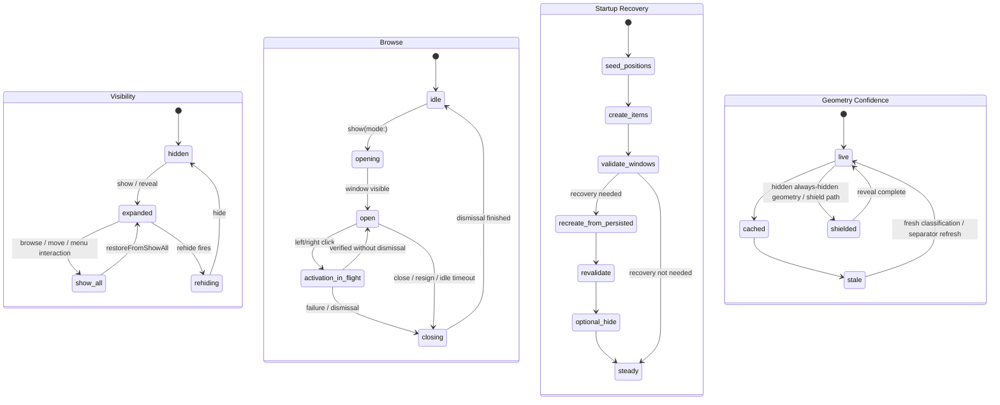

# SaneBar Runtime Audit

Date: 2026-03-18
Scope: startup recovery, Browse Icons / second menu bar activation, hidden-visible move behavior, and the process around those regressions

## Bottom line

This bug class is not one bug. It is a distributed coordination problem with weak contracts between runtime owners.

The current design is not hopeless, but it is fragile:
- `MenuBarManager` owns too much startup and recovery policy.
- `SearchService.activate()` owns too much browse activation policy.
- geometry confidence is implicit instead of modeled.
- verification is strong on helper math and guard presence, weak on real user-visible invariants.

The right next move is not a full rewrite. It is a narrow coordinator and stricter runtime contracts.

## Current runtime model

There is no single authoritative state machine in code today. The real runtime is the product of five owners:
- `MenuBarManager`
- `StatusBarController`
- `HidingService`
- `SearchWindowController`
- `SearchService`

The safest way to reason about the system is as four parallel state axes plus one operation planner.

## Proven bug families

### Family A: startup/layout recovery collapse

Evidence:
- GitHub `#111`, `#113`, `#114`, `#115`
- email `#387`
- `MenuBarManager.setupStatusItem()`
- `MenuBarManager.schedulePositionValidation()`
- `StatusBarController.recoverStartupPositions()`

Observed pattern:
- layout looks right briefly, then collapses or shifts left
- visible items can fall back into hidden
- the same symptom survives update, restart, or delayed validation

Assessment:
- this is one family with several repro surfaces
- the exact mechanism for every report is not proven identical, but the recovery ladder is the shared hotspot

### Family B: browse activation false-success / focus steal

Evidence:
- GitHub `#116`
- email `#384`
- older second-menu-bar thread `#101`
- `SearchService.activate()`

Observed pattern:
- right-click browse flashes
- sometimes needs a second click
- focus jumps back to a previously used app

Assessment:
- distinct from startup collapse
- the fixed branch in `cdc5206` proves there was a real policy seam in browse activation

### Family C: hidden-visible move / identity drift

Evidence:
- GitHub `#117`
- email `#364`
- likely email `#368`
- older move thread `#109`
- `MenuBarManager+IconMoving.swift`
- `SearchService.resolveLatestClickTarget()`

Observed pattern:
- wrong icon moves instead of the requested one
- hidden-visible add can beachball
- success can be reported while the wrong thing happened

Assessment:
- the core risk is identity precision plus stale geometry
- the current same-bundle fallback is too permissive for actionable flows

## What is fragile in the design

### 1. Startup recovery has no single planner

`setupStatusItem()` and `schedulePositionValidation()` both perform recovery logic. `StatusBarController` also mutates persisted positions during recovery. That means launch, delayed validation, and persistence repair can each change the layout without one shared escalation order.

### 2. Browse activation is over-coupled

`SearchService.activate()` decides reveal policy, wait policy, target refresh, click execution, retry, verification, and fallback. That is too much for one method in a bug class where the user-visible failure is policy-sensitive.

### 3. Geometry confidence is implicit

The code distinguishes live, cached, stale, and special hidden-state geometry, but it expresses that through booleans, nullable frames, and ad hoc checks. That makes wrong actions look locally reasonable.

### 4. Success semantics are loose

Some move paths effectively report success when work was queued or a coarse verification passed. That is not strong enough for shared-bundle items or fragile startup state.

### 5. The docs drifted from reality

`docs/state-machines.md` is stale. The playbook is closer, but its issue map is out of date. Internal research notes are newer than the public debugging docs, which is how teams end up patching by memory instead of by model.

## What is wrong with the process

### 1. The strongest runtime failures were not encoded as required release invariants

Current smoke proves:
- canonical launch
- layout stabilization
- browse panel opens
- sampled move round-trips

Current smoke does not prove:
- failed browse activation preserves frontmost app/window
- startup restore keeps a sane visible-lane width
- shared-bundle items move by exact requested identity

### 2. Source-string tests were treated as stronger proof than they are

`RuntimeGuardXCTests` are useful guardrails. They are not runtime proof. The project blurred that line.

### 3. The checklist drifted from the live bug buckets

The current E2E checklist does not force restart/login/display-change/shared-bundle/focus-integrity coverage for this class.

### 4. Support confidence outran field proof

Several “should be fixed in the next build” replies were followed by more reports in the same family. That is a release-discipline problem, not just a code problem.

### 5. Research gating itself is now part of the workflow risk

The Mini verify lane refreshes issue-cluster locks. If fresh runtime research is not written after the latest issue movement, verify blocks even when the investigation exists in memory and working notes.

## Falsifiable hypotheses

These are the highest-value hypotheses to test next.

### H1. Same-bundle fallback causes wrong-target actions

Prediction:
- if actionable flows reject bundle-only identity, `#117`-class bugs turn into explicit “unsupported target” failures instead of wrong-icon moves

Test:
- run move and browse smoke against at least one Control Center-family exact-ID item and assert the requested `unique_id` is the one that changed

### H2. Startup collapse is a phase-order bug, not one bad formula

Prediction:
- if startup recovery becomes `plan -> recreate once -> validate -> optional hide`, `#111/#115` repros stop bumping autosave namespace when a current-width backup already exists

Test:
- seed current-width backups plus `main=0 / separator=1`, relaunch, and assert backup restore wins over ordinal reseed

### H3. Stale geometry is being treated as good enough for actions

Prediction:
- if move/activation flows refuse `stale` or `shielded` geometry, failures become bounded retries instead of wrong-zone success

Test:
- force stale separator cache and hidden-state geometry, then assert the flow retries or aborts without taking action

### H4. Browse policy and click execution need separation

Prediction:
- if failed browse activation cannot trigger workspace fallback from the browse path, frontmost-app jumps disappear

Test:
- inject a forced failed browse activation and assert frontmost app and front window stay unchanged

### H5. A narrow coordinator reduces race exposure without a rewrite

Prediction:
- if a single coordinator serializes startup recovery, browse activation, and moves, stress smoke shows no `hide()` during active browse or move flows

Test:
- instrument those operations and run repeated reveal/browse/move/dismiss cycles

## Minimum hardened test matrix

This should become required before calling this class fixed.

1. Cold-start restore with valid current-width backup and poisoned `main=0 / separator=1`.
2. Cold-start with `autoRehide=false` and proof that no initial hide fires.
3. Right-click browse focus-integrity test on both a stable precise item and a shared-bundle item.
4. Hidden-visible move from stale-geometry conditions with exact-ID verification.
5. Shared-bundle move test for Control Center-family items.
6. Restart/update recovery test where persisted backups must beat ordinal reseed.

## Recommended design change

Do not do a full reducer rewrite now.

Do this instead:
- add a narrow `OperationCoordinator`
- add a typed `RuntimeSnapshot`
- keep current owners for effects
- centralize only the risky planning for startup recovery, browse activation, and move policy

Minimum snapshot fields:
- `identityPrecision`
- `geometryConfidence`
- `visibilityPhase`
- `browsePhase`

That is the smallest change likely to reduce fragility without exploding the codebase.
